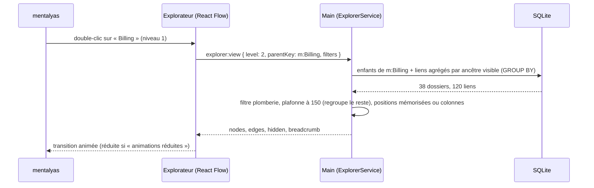

# Niveau 3 — Conception Technique : R3 — Explorateur à niveaux
> Basé sur : L1f-reprise-projet.md + L2-reprise-explorateur.md + L3-reprise-analyse.md · Date : 2026-10-06

## 0. Choix techniques
| Sujet | Choix proposé | Pourquoi |
|-------|---------------|----------|
| Rendu | **React Flow** (déjà dans l'app) | L'agrégation (R3-1) et le plafond de ~150 nœuds affichés (R3-2) gardent le rendu petit : pas besoin d'un moteur WebGL pour le MVP. Même bibliothèque que la carte, mêmes composants, mêmes tests |
| Plan B mesuré | `sigma.js` + `graphology` (WebGL, MIT) | Seulement si la mesure de R3-8 échoue, ou pour la direction artistique de la v3 (particules, halos) |
| Agrégation | **Calculée dans le main** (SQL `GROUP BY` sur l'ancêtre du niveau demandé) | L'interface ne reçoit jamais le graphe complet (50 000 liens) |
| Mise en page | **Colonnes par catégorie** (orchestration → métier → infrastructure), ordre dans la colonne par barycentre des voisins (méthode de Sugiyama simplifiée), positions mémorisées | Lecture du flux de gauche à droite, sans nouvelle dépendance ; ELK (`elkjs`, EPL-2.0, ~1 Mo) gardé en alternative |
| Zoom sémantique | Seuils sur le zoom React Flow (`onMove`) + double-clic + fil d'Ariane | Navigation naturelle ; chaque niveau est une requête au main |
| Code | **highlight.js** (déjà dans l'app), texte échappé | Aucune dépendance nouvelle |

## 1. Contrat IPC
| Canal | Entrée | Sortie | Codes d'erreur |
|-------|--------|--------|----------------|
| `explorer:view` | `{ genesisId, level: 1..4, parentKey?: string, focusId?: string, depth?: 1 \| 2, filters: { categories[], langs[], hideUncertain } }` | `{ nodes[≤150], edges[], grouped: { key, count }[], hidden: { plumbingCalls, nodes }, breadcrumb[] }` | `NOT_FOUND`, `NOT_ANALYZED` |
| `explorer:node` | `{ genesisId, nodeKey }` | `{ kind, title, path, category, lang, lines, summary \| null, callers[≤50], callees[≤50], verdict \| null }` | `NOT_FOUND` |
| `explorer:code` | `{ genesisId, symbolId }` | `{ path, startLine, lines: string[≤200], lang }` | `NOT_FOUND`, `SECRET_FILE` |
| `explorer:search` | `{ genesisId, query: string 2..100 }` | `{ results[≤30]: { nodeKey, level, title, path } }` | — |
| `explorer:savePosition` | `{ genesisId, level, parentKey, nodeKey, x, y }` | `{}` | `NOT_FOUND` |

`node` : `{ key, level, kind, title, category, verdict?, childCount, x?, y? }` ; `edge` : `{ from, to, count, provenance:
'syntax' | 'deduced' | 'uncertain' (la plus faible des liens agrégés) }`.

## 2. Schéma de données détaillé
| Table | Colonnes | Contraintes | Index |
|-------|----------|-------------|-------|
| `code_layout` | `genesis_id` · `level` · `parent_key` · `node_key` · `x` · `y` · `pinned` (déplacé par mentalyas) | PK `(genesis_id, level, parent_key, node_key)` | — |
| `code_explorer_state` | `genesis_id` PK · `filters_json` · `last_level` · `last_parent_key` · `viewport_json` | — | — |

Clés de nœud : `m:<moduleKey>`, `d:<chemin dossier>`, `f:<chemin fichier>`, `s:<symbolId>`.

## 3. Diagramme de séquence (zoom sur un module)

## 4. Cas limites techniques
- **Concurrence :** réanalyse en cours → l'explorateur affiche le dernier graphe complet avec un bandeau « analyse en
  cours » ; recharge à `reprise:analysisDone`.
- **Idempotence :** `explorer:view` est une lecture pure ; positions en upsert.
- **Transactions :** aucune écriture hors `code_layout` / `code_explorer_state`.
- **Volumétrie :** requête d'agrégation indexée (`from_symbol_id`, `to_symbol_id`) — cible < 100 ms pour 50 000 liens ;
  mise en cache par `(level, parentKey, filtres)` invalidée à chaque `run` ; au plus 150 nœuds et 400 liens envoyés.
- **Projet sans modules** : le niveau 1 montre les dossiers racine.

## 5. Sécurité spécifique à cette fonctionnalité
| Risque | Vecteur | Mitigation |
|--------|---------|------------|
| XSS | Nom de fonction, chemin ou code contenant du HTML | Texte rendu par React (échappé) ; highlight.js sur texte échappé ; jamais `dangerouslySetInnerHTML` sans échappement |
| Lecture arbitraire | `explorer:code` avec un id forgé | Seul un `symbolId` connu de ce genesis ; lecture du fichier sous `root_dir` (`realpath`) ; fichiers de secrets refusés |
| Fuite par l'interface | Chemins absolus | L'interface ne reçoit que des chemins **relatifs** au projet |
