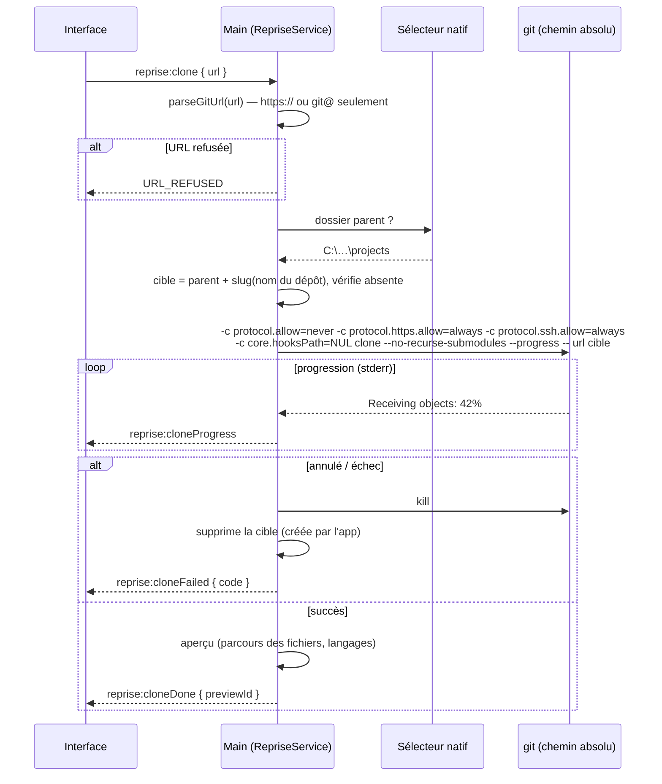

# Niveau 3 — Conception Technique : R1 — Import d'un projet et confidentialité
> Basé sur : L1f-reprise-projet.md + L2-reprise-import.md · Réutilise : `GitCli` (spec 016, git par chemin absolu),
> sélecteur natif (spec 008), `ConversationService` (spec 014) · Date : 2026-10-06

## 1. Contrat IPC
Le chemin d'un projet n'est **jamais** une entrée venue de l'interface : le main le tient, référencé par un
`previewId` éphémère (UUID, 15 min).

| Canal | Entrée (Zod) | Sortie | Codes d'erreur |
|-------|--------------|--------|----------------|
| `reprise:previewFolder` | — (sélecteur natif) | `{ previewId, name, languages[], files, ignored, git, alreadyLinked: genesisId \| null }` ou `null` (annulé) | `FOLDER_REFUSED` (dossier de données), `TOO_LARGE` |
| `reprise:clone` | `{ url: string ≤ 500 }` (+ sélecteur natif du dossier parent) | `{ cloneId }` ; événements `reprise:cloneProgress` `{ cloneId, phase, percent }` puis `reprise:cloneDone` `{ cloneId, previewId }` ou `reprise:cloneFailed` `{ cloneId, code }` | `URL_REFUSED`, `GIT_MISSING`, `TARGET_EXISTS`, `BUSY` (un clone à la fois) |
| `reprise:cancelClone` | `{ cloneId }` | `{}` | `NOT_FOUND` |
| `reprise:create` | `{ previewId, confidentiality: 'claude' \| 'local' }` (obligatoire, pas de défaut) | `{ genesisId }` | `NOT_FOUND` (aperçu expiré), `ALREADY_LINKED` |
| `reprise:setConfidentiality` | `{ genesisId, level, confirm?: true }` | `{ level }` | `CONFIRM_REQUIRED` (local → claude sans confirmation) |

Codes de `reprise:cloneFailed` : `AUTH_FAILED`, `NOT_FOUND`, `NETWORK`, `CANCELLED`, `TIMEOUT`, `FAILED`.

## 2. Schéma de données détaillé
Migration `00NN_reprise_projet` (+ down écrit à la main).

| Table | Colonnes | Contraintes | Index |
|-------|----------|-------------|-------|
| `code_projects` | `genesis_id` text PK → `neurons.id` · `root_dir` text (chemin réel) · `source` text (`folder` \| `git`) · `remote_url` text null (**sans identifiants**) · `confidentiality` text (`claude` \| `local`) · `confidentiality_changed_at` text · `created_at` · `analyzed_at` text null · `analysis_state` text (`idle` \| `running` \| `failed`) | `confidentiality` NOT NULL ; un `root_dir` par projet | `UNIQUE(root_dir)` |

Le genesis reste un neurone ordinaire (`kind = 'root'`) lié au dossier (`project_dir`, spec 008) ; `code_projects` le
marque « projet repris ». Ses éléments de structure (spec 009) héritent de sa confidentialité via `genesis_id`.

### Garde de confidentialité (transverse)
`ConfidentialityGuard.claudeAllowed(neuronId): boolean` — remonte au genesis, lit `code_projects.confidentiality`
(absent = projet non repris = autorisé). Appelée **avant** tout envoi à Claude :
`ConversationService.start`/`send`, tâches `claude -p` de la reprise (résolution R2, guide R4, diagnostic R5), outils
MCP de lecture du graphe. En `local` : conversation refusée (`LOCAL_ONLY`) ; tâches routées vers Ollama.

## 3. Diagramme de séquence (clone)

## 4. Cas limites techniques
- **Concurrence :** un seul clone à la fois (`BUSY`) ; une seule analyse par projet (`analysis_state`).
- **Idempotence :** `reprise:create` consomme le `previewId` (rejeu → `NOT_FOUND`) ; `UNIQUE(root_dir)` empêche deux
  genesis sur le même dossier (`ALREADY_LINKED` renvoie celui qui existe).
- **Transactions / rollback :** création du genesis + `code_projects` dans une transaction ; clone échoué → suppression
  du seul dossier cible créé par l'app (jamais s'il existait avant : contrôlé avant le lancement).
- **Volumétrie :** parcours des fichiers en flux (sans tout charger), arrêt à 20 000 fichiers retenus (`TOO_LARGE` avec
  le décompte) ; délai du clone 30 min.
- **Authentification :** `GIT_TERMINAL_PROMPT=0` (aucune invite dans une console cachée) ; le gestionnaire
  d'identifiants de git (fenêtre Windows) reste utilisable ; échec → `AUTH_FAILED`.

## 5. Sécurité spécifique à cette fonctionnalité
| Risque | Vecteur | Mitigation |
|--------|---------|------------|
| Exécution de commande à l'import | URL `ext::sh -c …`, `file://`, URL commençant par `-` | `parseGitUrl` (liste blanche `https://` / `git@hôte:chemin`) + `protocol.allow=never` sauf https/ssh + URL après `--` |
| Hook ou sous-module piégé | `.gitmodules`, hooks | `--no-recurse-submodules`, `core.hooksPath=NUL` ; rien du projet n'est lancé |
| Fuite d'identifiants | URL `https://user:jeton@…` collée | Identifiants retirés avant tout stockage, affichage ou log ; jamais en base |
| Fuite de secrets du projet | `.env`, clés, `appsettings.*.json`, `web.config` | Filtre `SecretFiles` appliqué au parcours : ces fichiers ne sont ni lus, ni indexés, ni envoyés (test) |
| Envoi interdit à Claude | Projet « local » | `ConfidentialityGuard` à chaque point d'envoi + test d'intégration « aucun spawn `claude` pour un projet local » |
| Lecture hors périmètre | Liens symboliques, jonctions Windows | `lstat` ; liens non suivis ; chemins résolus par `realpath` et contrôlés sous `root_dir` |
| Dossier de l'app exposé | Import du dossier de données | Refus si `realpath` égal ou parent / enfant du dossier de données |
| Exécutable piégé | `git.exe` dans le dossier courant | git résolu par chemin absolu dans le PATH (spec 016) |
