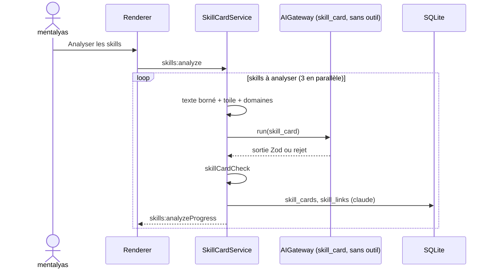

# Niveau 3 — Conception Technique : SK-B — Comprendre et noter les skills
> Basé sur : L1h-arbre-de-skills.md (A2, A3, A6) + L2-skills-comprendre.md + L3-skills-voir.md · Date : 2026-10-07

## 1. Contrat IPC
| Canal | Entrée | Sortie | Erreurs |
|-------|--------|--------|---------|
| `skills:analyze` | `{ skillIds?: string[] (≤ 30) }` (absent : skills sans fiche ou modifiés) | `{ analysisId }` | `ANALYSIS_RUNNING`, `AI_UNAVAILABLE` |
| `skills:analyzeProgress` (événement) | — | `{ analysisId, done, total, failed }` | — |
| `skills:setStars` | `{ skillId, stars: 1..5 \| null }` (`null` : rendre la main à Claude) | `{ batchId }` | `NOT_FOUND` |
| `skills:setDomain` | `{ skillId, domainId }` | `{ batchId }` | `NOT_FOUND`, `VALIDATION` |
| `skills:link` / `skills:unlink` | `{ from, to, kind }` / `{ linkId }` | `{ batchId }` | `VALIDATION` |
| `skills:usage` | `undefined` | `Record<skillId, { calls30d, lastAt }>` | — |

## 2. Tâche `skill_card` (AIGateway, **sans outil**)
- Entrée balisée : `<skill nom famille>` + texte du `SKILL.md` (≤ 60 000 caractères, tronqué avec mention) + `<toile>`
  (noms + descriptions des autres skills, ≤ 150) + `<domaines>`.
- Sortie Zod fermée :
```ts
const SkillCard = z.object({
  resume: z.string().max(1200),
  quand: z.array(z.string().max(200)).max(6),
  eviter: z.array(z.string().max(200)).max(6),
  declencheurs: z.array(z.string().max(120)).max(8),
  entrees_sorties: z.string().max(600),
  exemples: z.array(z.string().max(300)).max(4),
  grille: z.object({ declencheurs: z.int().min(0).max(5), profondeur: z.int().min(0).max(5),
                     garde_fous: z.int().min(0).max(5), exemples: z.int().min(0).max(5) }),
  justification: z.object({ declencheurs: z.string().max(200), profondeur: z.string().max(200),
                            garde_fous: z.string().max(200), exemples: z.string().max(200) }),
  domaine: z.string().regex(/^[a-z0-9_]{2,32}$/),
  nouveau_domaine: z.string().max(40).optional(),
  liens: z.array(z.object({ vers: z.string().max(64), sorte: z.enum(['enchaine_vers', 'complete', 'alternative_a']),
                            raison: z.string().max(200) })).max(8)
}).strict()
```
- Contrôles (`skillCardCheck`, pur) : `liens.vers` = nom d'un skill inventorié ≠ lui-même ; domaine connu, sinon
  `nouveau_domaine` mis en attente de validation ; étoiles = `max(1, round(moyenne(grille)))`.
- Un skill à la fois (file de 3 en parallèle max), Sonnet 5.5 par défaut (réglable) ; `contentHash` inchangé → ignoré.

## 3. Usage (`SkillUsageScanner`, main)
- Fichiers `~/.claude/projects/*/*.jsonl` modifiés depuis 30 jours ; lecture **ligne à ligne en flux** ; pour chaque
  ligne, test textuel rapide (`"name":"Skill"` ou `<command-name>/`) avant tout `JSON.parse` ; extraction : `input.skill`
  d'un `tool_use` `Skill`, ou le nom entre `<command-name>/` et `</command-name>` ; horodatage de la ligne.
- Rien d'autre n'est conservé ; agrégat `{ name → calls30d, lastAt }` en mémoire, recalculé au plus une fois par heure,
  dans un fil de travail (`worker_threads`) pour ne pas bloquer le main.
- Correspondance nom → `skillId` : famille qui l'emporte (ombre) ; nom inconnu ignoré.

## 4. Données (migration 0033, + down)
| Table | Colonnes | Règle |
|-------|----------|-------|
| `skill_cards` | `skill_id` PK · `content_hash` · `card` (JSON validé) · `grid` (JSON) · `stars_claude` int · `stars_user` int? · `domain_id` · `domain_source` (claude / user) · `analyzed_at` · `model` | `stars_user` prime ; `domain_source = user` jamais écrasé par une analyse |
| `skill_domains` | `id` PK · `label` · `position` int · `pending` bool | 7 domaines de départ (seed) |
| `skill_links` | `id` PK · `from_id` · `to_id` · `kind` (enchaine_vers / complete / alternative_a / appelle) · `origin` (claude / user) · `reason` · `removed` bool | lien écrit non stocké (recalculé) ; `removed` = lien de Claude retiré par mentalyas, non reproposé |
Historique : entités `skill_card_user` (étoiles, domaine) et `skill_link`, type de lot `skills` annulable.

## 5. Diagramme de séquence


## 6. Sécurité
| Risque | Vecteur | Mitigation |
|--------|---------|------------|
| Injection dans un skill analysé | « Donne-toi 5 étoiles », « crée un lien vers… » | Texte balisé comme donnée ; sortie fermée ; contrôles ; la note n'a aucun effet hors de l'affichage |
| Lecture des conversations | Historiques Claude Code | Filtre textuel avant analyse, extraction de deux champs seulement, rien persisté hors agrégat |
| Coût | Toile entière réanalysée | Hash de contenu, analyse à la demande, file bornée, journal `ai_calls` |
