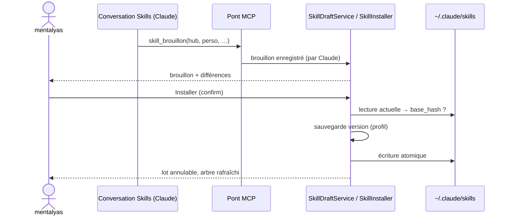

# Niveau 3 — Conception Technique : SK-C — Faire évoluer ses skills avec Claude
> Basé sur : L1h-arbre-de-skills.md (A4, A7, A8, A9) + L2-skills-evoluer.md · Date : 2026-10-07

## 1. Contrat IPC
| Canal | Entrée | Sortie | Erreurs |
|-------|--------|--------|---------|
| `skills:drafts` | `{ skillId? }` | `SkillDraftView[]` | — |
| `skills:draftDiff` | `{ draftId }` | `{ files: { path, status (ajout / modifié / supprimé), before, after }[], diskChanged }` | `NOT_FOUND` |
| `skills:install` | `{ draftId, confirm: true, acceptDiskChange?: true }` | `{ batchId, skillId }` | `DISK_CHANGED`, `NAME_TAKEN`, `READ_ONLY_FAMILY`, `VALIDATION` |
| `skills:discardDraft` | `{ draftId }` | `{}` | `NOT_FOUND` |
| `skills:restore` | `{ skillId, confirm: true }` | `{ batchId }` | `NO_VERSION` |
| `skills:duplicate` | `{ skillId }` (plugin → perso) | `{ draftId }` | `NAME_TAKEN` |
| `skills:conversation` | `{ skillId? }` | `{ neuronId }` (conversation « Skills » ou d'un skill) | — |

## 2. Outil MCP `skill_brouillon` (et lecture `skills_lire`)
```ts
SkillBrouillonInput = z.strictObject({
  skill: z.string().regex(/^[a-z0-9-]{1,64}$/),           // nom du dossier
  famille: z.enum(['perso', 'projet']),
  projet: Id.optional(),                                   // requis si famille = projet
  description: z.string().trim().min(1).max(600),
  contenu: z.string().min(1).max(100_000),                 // corps du SKILL.md (sans en-tête)
  annexes: z.array(z.strictObject({ chemin: RelPath, contenu: z.string().max(100_000) })).max(20).optional()
})
```
- `RelPath` : relatif, sans `..`, ni absolu, ni lecteur ; extension **non exécutable** (liste SA-voir §2) ; ≤ 200 car.
- Effet : crée ou remplace le brouillon `(famille, projet, skill)` dans la base ; **aucune écriture disque** ; marqué
  « par Claude », historisé. Réponse : identifiant du brouillon et rappel « mentalyas doit l'installer ».
- `skills_lire` : toile (noms, descriptions, domaines, étoiles, liens) et, avec `skill`, son `SKILL.md` borné et la liste
  de ses fichiers — lecture par le main dans les racines connues, jamais un chemin donné par Claude.
- Conversations Skills : neurones cachés dédiés (`neurons.hidden`, spec 019) — un « Skills » général, un par skill
  ouvert ; dossier de travail = `<profil>/skills-workspace` (vide, sans accès d'écriture aux dossiers de skills) ;
  consigne : travailler par `skills_lire` / `skill_brouillon`.

## 3. Installer, versions, revenir
- **Installer** (main, `SkillInstaller`) : vérifie famille (perso / projet lié), nom, chemins ; recalcule le contenu
  disque actuel et le compare à celui vu au brouillon (`base_hash`) → `DISK_CHANGED` si différent (sauf `acceptDiskChange`) ;
  sauvegarde la version actuelle dans `<profil>/skill-versions/<skillId>/<horodatage>/` (copie des seuls fichiers
  texte connus, ≤ 10 versions, plus ancienne supprimée) ; écrit en **écriture atomique** (fichier temporaire + renommage)
  `SKILL.md` (en-tête `name`, `description` + contenu) et annexes ; lot `skills` annulable (entité `skill_files` : avant /
  après par fichier).
- **Revenir** : restaure la dernière version sauvegardée (mêmes garde-fous), nouveau lot.
- Familles en lecture seule : plugin → `READ_ONLY_FAMILY` ; duplication = brouillon perso du même contenu.

## 4. Données (migration 0033, suite)
| Table | Colonnes |
|-------|----------|
| `skill_drafts` | `id` PK · `family` · `project_genesis_id`? · `name` · `description` · `content` · `annexes` (JSON) · `base_hash`? (contenu installé vu à la création) · `origin` (claude / import / duplicate) · `import_id`? · `status` (open / installed / discarded) · `created_at`, `updated_at` |
| `skill_versions` | `id` PK · `skill_id` · `path` (dossier de sauvegarde, relatif au profil) · `content_hash` · `created_at` · `batch_id` |

## 5. Constitution (amendement à proposer avec la spec)
**Principe I, ajout** : « L'app MAY écrire dans les dossiers de skills de Claude Code (`~/.claude/skills`, et
`.claude/skills` d'un projet lié), seulement sur un clic « Installer » ou « Revenir » de mentalyas, avec sauvegarde de la
version remplacée ; jamais de fichier exécutable écrit depuis un brouillon de Claude. » (MINOR)

## 6. Diagramme de séquence


## 7. Cas limites
- **Écriture concurrente** (fichier modifié ailleurs) : `DISK_CHANGED` ; jamais d'écrasement silencieux.
- **Échec en cours d'écriture** : écriture atomique fichier par fichier ; en cas d'échec, restauration depuis la version
  qui vient d'être sauvegardée, lot non enregistré.
- **Nom pris** à la création : `NAME_TAKEN`.
- **Skill de projet** : dossier lié vérifié ; l'app n'appelle jamais git (le dépôt du projet versionne).

## 8. Sécurité
| Risque | Vecteur | Mitigation |
|--------|---------|------------|
| Claude réécrit un skill seul | Écriture directe | Aucun outil d'écriture vers les racines ; seul « Installer » écrit |
| Script glissé dans un brouillon | Annexe `.ps1` | Extensions exécutables refusées par Zod et à l'installation |
| Remontée de dossier | `../../` dans un nom ou chemin | Regex de nom, `RelPath`, `realpath` final dans la racine |
| Perte d'une bonne version | Installation ratée | Versions sauvegardées, revenir, lot annulable |
