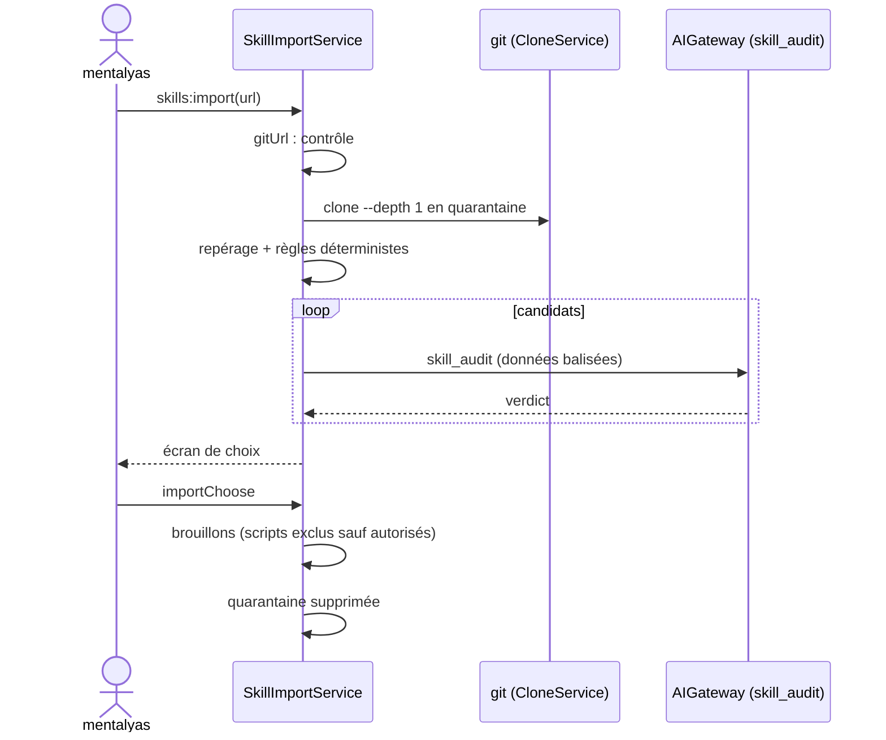

# Niveau 3 — Conception Technique : SK-D — Importer des skills depuis GitHub
> Basé sur : L1h-arbre-de-skills.md (A5) + L2-skills-importer.md + spec 017 US5 (T028–T031, en pause) · Date : 2026-10-07

## 1. Contrat IPC
| Canal | Entrée | Sortie | Erreurs |
|-------|--------|--------|---------|
| `skills:import` | `{ url: string ≤ 500 }` | `{ importId }` | `URL_REFUSED`, `IMPORT_RUNNING` |
| `skills:importProgress` (événement) | — | `{ importId, step: clone / reperage / analyse / pret / echec, done?, total?, errorCode? }` | — |
| `skills:importView` | `{ importId }` | `{ repo (sans identifiant), commit, skills: ImportedSkillView[] }` | `NOT_FOUND` |
| `skills:importChoose` | `{ importId, keep: { candidateId, scripts: string[] }[], unlockDangerous?: string[] }` | `{ draftIds: string[] }` | `VALIDATION`, `DANGEROUS_LOCKED` |
| `skills:importCancel` | `{ importId }` | `{}` | — |

`ImportedSkillView` : `{ candidateId, name, description, files: { path, size, executable }[], verdict (sur / a_revoir /
dangereux), reasons: { text, line? }[], conflictsWith?: skillId }`.

## 2. Clone en quarantaine (reprise de la spec 017 US5)
- `gitUrl.ts` (pur, T028 de la spec 017) : `https://` et `git@` seulement ; identifiants retirés de l'URL affichée et
  stockée ; refus de `ext::`, `file://`, `fd::`, d'un premier caractère `-`, de caractères de contrôle.
- `CloneService` (T029 de la spec 017) réutilisé : `git clone --depth 1 --no-recurse-submodules -c core.hooksPath=<vide>
  -- <url> <quarantaine>` (arguments fixes, `GIT_TERMINAL_PROMPT=0`), délai 5 min, un clone à la fois, annulation et
  nettoyage du seul dossier créé, échecs classés (auth, introuvable, réseau, trop gros).
- Quarantaine : `<profil>/skill-quarantine/<importId>/` ; supprimée après `importChoose` / `importCancel`, et toute
  quarantaine restante au démarrage.
- Limites : 50 Mo (mesuré après clone ; dépassement → suppression, `TOO_LARGE`), 2 000 fichiers, 30 `SKILL.md`.

## 3. Repérage et audit
- Repérage (pur sur la liste de fichiers) : tout `SKILL.md` à profondeur ≤ 4 ; dossier du skill = son dossier ; fichiers
  du skill = son sous-arbre ; `executable` (même liste que SK-A) ; liens symboliques ignorés.
- **Tâche `skill_audit` (AIGateway, sans outil)** : entrée balisée = `SKILL.md` (≤ 60 000 car.) + liste des fichiers +
  extraits des scripts (≤ 200 lignes chacun, ≤ 5 scripts), le tout comme **données** ; consigne figée : repérer consignes
  cachées (outrepasser des règles, exfiltrer, désactiver des confirmations, agir à l'insu de l'utilisateur), commandes
  destructrices, accès réseau ou secrets, code obscurci.
- Sortie Zod : `{ verdict: enum(sur, a_revoir, dangereux), raisons: { texte ≤ 200, ligne? }[] ≤ 8, role ≤ 300 }` ;
  sortie invalide ou indisponible → `a_revoir` (« analyse impossible »).
- Règles déterministes en plus (pures, prioritaires si plus sévères) : présence de `curl|wget|Invoke-WebRequest` +
  exécution, `rm -rf`, `Remove-Item -Recurse`, encodage base64 exécuté, mots « ignore previous / ignore tes consignes » →
  au moins `a_revoir`.

## 4. Choix et brouillons
- `importChoose` : pour chaque candidat gardé, brouillon `origin = import` (famille perso par défaut), contenu lu dans la
  quarantaine, annexes **texte non exécutables** seulement + scripts explicitement listés dans `scripts` (avertissement
  affiché avant) ; candidat `dangereux` refusé sauf s'il figure dans `unlockDangerous` (second avertissement côté UI).
- Origine gardée sur le brouillon puis sur la fiche : `{ repo, commit, path }`.
- Les scripts autorisés passent par l'installation (SK-C) avec une exception : l'interdiction d'écrire un exécutable ne
  vaut que pour les brouillons de Claude ; un script d'import autorisé fichier par fichier est écrit (jamais exécuté par
  l'app).

## 5. Données (migration 0033, suite)
| Table | Colonnes |
|-------|----------|
| `skill_imports` | `id` PK · `repo` (sans identifiant) · `commit`? · `status` (clone / audit / ready / done / cancelled / failed) · `error_code`? · `created_at`, `finished_at` |
| `skill_import_candidates` | `id` PK · `import_id` FK · `name` · `rel_dir` · `files` (JSON) · `verdict` · `reasons` (JSON) · `kept` bool |

## 6. Diagramme de séquence

## 7. Sécurité
| Risque | Vecteur | Mitigation |
|--------|---------|------------|
| Exécution à l'import | hooks git, sous-modules, scripts | hooks désactivés, pas de sous-modules, rien d'exécuté, pas de `npm install` |
| URL piégée | `ext::`, option `-…` | `gitUrl.ts`, `--` avant l'URL |
| Audit trompé | Consigne cachée visant l'analyste | Tâche sans outil, données balisées, règles déterministes prioritaires, revue humaine obligatoire |
| Skill malveillant installé | Clic trop rapide | `dangereux` verrouillé, scripts exclus par défaut, double avertissement, versions et retour arrière |
| Fuite d'identifiants | URL avec jeton | Identifiants retirés, jamais journalisés ni stockés |
