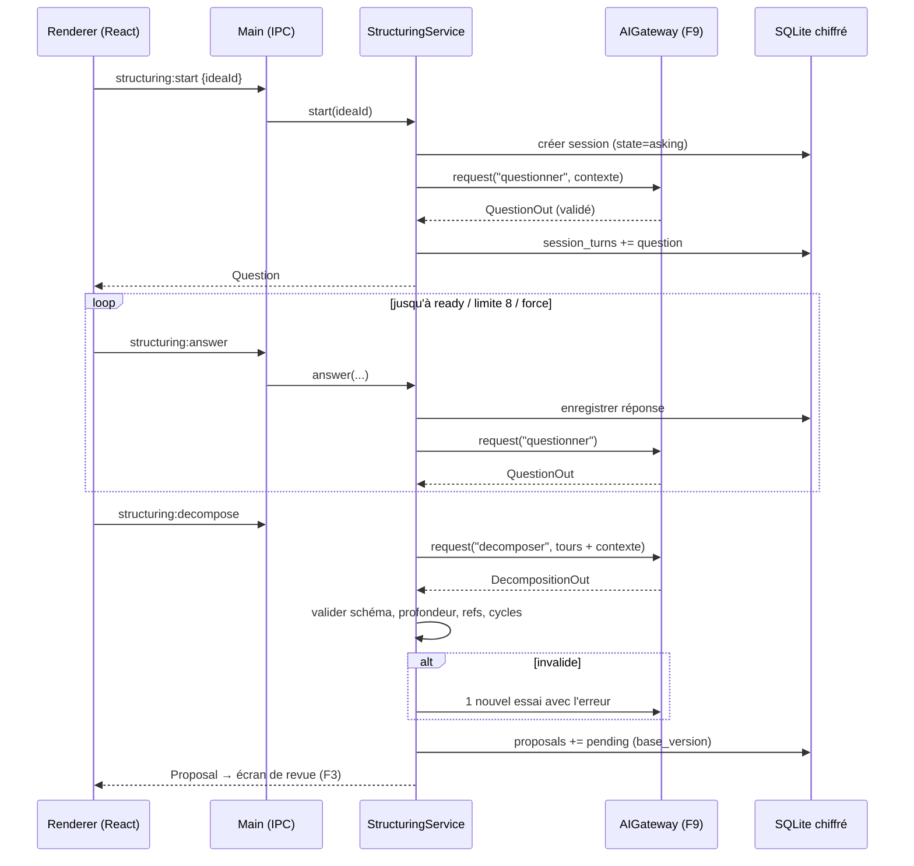

# Niveau 3 — Conception Technique : F2 — Structuration IA (+ modèle de données central)
> Basé sur : docs/brainstorm/L1-fondation.md + docs/brainstorm/L2-structuration-ia.md (+ L2-validation, L2-organigramme)
> Date : 2026-09-28 · Livraison : MVP-1

> **Note d'architecture.** App Electron mono-utilisateur : il n'y a **pas d'API HTTP**. Le « contrat API »
> est le contrat **IPC** (Inter-Process Communication — canal de messages entre la fenêtre React, le
> *renderer*, et le processus principal Node, le *main*). Le renderer n'a **aucun** accès direct à la base,
> au disque ou au réseau : tout passe par des canaux IPC nommés, typés et validés (Zod) dans le main.
> Ce fichier porte aussi le **schéma de données central** (idées, arbres, propositions), réutilisé par F3/F4/F5.

## 1. Contrat API (IPC renderer → main)

Convention : `ipcRenderer.invoke(canal, payload)` exposé via `contextBridge` ; réponse uniforme
`{ success: true, data } | { success: false, error: { code, message } }`.

| Canal | Entrée (validée Zod) | Sortie | Codes d'erreur |
|-------|----------------------|--------|-----------------|
| `idea:create` | `{ text: string(1..2000), draft?: boolean }` | `Idea` | `VALIDATION` |
| `idea:list` | `{ status?, category?, search?, cursor?, limit≤100 }` | `{ items: Idea[], nextCursor }` | `VALIDATION` |
| `idea:update` | `{ id, text?, categoryId? }` | `Idea` | `NOT_FOUND`, `VALIDATION` |
| `structuring:start` | `{ ideaId }` | `Session` + 1re `Question` | `NOT_FOUND`, `ALREADY_RUNNING`, `AI_UNAVAILABLE`, `BUDGET_EXCEEDED` |
| `structuring:answer` | `{ sessionId, questionId, answer: { choice?: string, text?: string(≤1000), unknown?: true } }` | `Question` suivante **ou** `{ ready: true }` | `NOT_FOUND`, `SESSION_CLOSED`, `AI_*` |
| `structuring:decompose` | `{ sessionId, force?: boolean }` | `Proposal` (statut `pending`) | `AI_INVALID_OUTPUT`, `CYCLE_DETECTED`, `AI_*` |
| `structuring:restructure` | `{ ideaId, change: string(≤1000) }` | `Session` | idem `start` |
| `structuring:abandon` | `{ sessionId }` | `{ ok: true }` | `NOT_FOUND` |

Événements main → renderer (push) : `structuring:progress` (l'IA réfléchit), `proposal:created`.

### Contrat de sortie IA (schémas Zod partagés, validés par `client.messages.parse` + revalidation locale)

```ts
// Question du questionnaire
QuestionOut = {
  kind: "question" | "ready" | "out_of_scope",
  text: string,                     // ≤ 300 caractères
  quickReplies?: string[],          // 0..4
  detectedOpportunity?: { title: string, amountCents?: number, expectedDate?: string /* ISO */ }
}

// Décomposition
DecompositionOut = {
  nodes: Array<{
    ref: string,                    // id temporaire, unique dans la proposition
    type: "task" | "condition" | "opportunity",
    title: string,                  // ≤ 120
    parentRef?: string,             // arbre (profondeur ≤ 5)
    branchLabel?: string,           // si enfant d'une condition : "Oui" / "Non" / …
    question?: string,              // si type = condition
    amountCents?: number,           // entier ≥ 0
    dueDate?: string,               // ISO, facultatif
    toSchedule?: boolean,           // candidat Outlook
    investigation?: boolean         // tâche « trouver l'info manquante »
  }>,
  dependencies: Array<{ fromRef: string, toRef: string, kind: "after_done" | "on_trigger", triggerLabel?: string }>,
  ideaLinks: Array<{ targetIdeaId: string, kind: "finances" | "related" | "blocks" }>,
  gaps: string[]                    // infos manquantes signalées
}
```

## 2. Schéma de données détaillé

**Moteur** : SQLite (fichier local dans `%APPDATA%/gestionnaire-idees/`), accès via **Drizzle ORM** +
`better-sqlite3-multiple-ciphers` (SQLite chiffré type SQLCipher). Clé de chiffrement générée au premier
lancement, protégée par `safeStorage` d'Electron (DPAPI Windows). Migrations versionnées avec `down`.

> Choix Drizzle plutôt que Prisma (standard global Node) : Prisma embarque un moteur binaire séparé,
> fragile à empaqueter dans Electron ; Drizzle est du TypeScript pur, compatible `better-sqlite3`,
> requêtes typées et paramétrées. **Écart au standard global validé par mentalyas le 2026-09-28** (inscrit dans le CLAUDE.md du projet).

### Tables
| Table | Colonnes | Contraintes | Index |
|-------|----------|-------------|-------|
| `categories` | id, slug, label, color, sort_order | slug unique ; 6 lignes seed (general, achat, projet, sortie, photo, it) | slug |
| `ideas` | id (uuid), text, category_id?, category_source (`ai`/`user`), status, created_at, updated_at, archived_at? | text 1..2000 ; status ∈ {draft, raw, questioning, pending_review, structured, done, archived} | status, category_id, created_at |
| `structuring_sessions` | id, idea_id, state, question_count, engine, started_at, closed_at? | state ∈ {asking, ready, decomposing, proposed, abandoned, failed} ; **1 seule session ouverte par idée** (index unique partiel `WHERE closed_at IS NULL`) | idea_id |
| `session_turns` | id, session_id, seq, question_json, answer_json?, created_at | seq unique par session | (session_id, seq) |
| `nodes` | id, idea_id, parent_id?, type, title, question?, branch_label?, amount_cents?, due_date?, status, active_branch (bool), to_schedule, investigation, position_x?, position_y?, created_at, updated_at | type ∈ {task, condition, opportunity} ; status ∈ {blocked, ready, in_progress, done, abandoned} ; amount_cents ≥ 0 ; profondeur ≤ 5 (vérif. applicative) | idea_id, parent_id, status, due_date |
| `dependencies` | id, from_node_id, to_node_id, kind, trigger_label?, trigger_reached_at? | kind ∈ {after_done, on_trigger} ; (from,to) unique ; pas d'auto-référence ; **pas de cycle** (vérif. applicative) | from_node_id, to_node_id |
| `idea_links` | id, idea_id, target_idea_id, kind, origin (`ai`/`user`) | (idea,target,kind) unique ; idea ≠ target | idea_id, target_idea_id |
| `proposals` | id, source (`decomposition`/`restructure`/`suggestion`), idea_id?, payload_json, base_version, status, reason?, created_at, decided_at? | status ∈ {pending, accepted, rejected, superseded, stale} | status, idea_id |
| `change_log` | id, proposal_id?, actor (`user`/`ai_accepted`), entity, entity_id, before_json, after_json, created_at | append-only | created_at, entity_id |

`ideas.version` (entier incrémenté à chaque changement de l'idée ou de son arbre) sert à détecter une
proposition **périmée** (`proposals.base_version ≠ ideas.version` → `stale`).

## 3. Diagramme de séquence (Mermaid)


## 4. Cas limites techniques
- **Concurrence :** une seule session ouverte par idée (index unique partiel). Une édition manuelle de
  l'idée pendant le questionnaire incrémente `ideas.version` → la proposition produite sera `stale`.
- **Idempotence :** `structuring:answer` porte `questionId` ; une réponse déjà enregistrée pour ce tour est
  ignorée (double-clic). `decompose` sur une session déjà `proposed` renvoie la proposition existante.
- **Transactions / rollback :** l'acceptation d'une proposition (F3) = **une transaction SQLite** :
  création des `nodes` (refs → uuid), `dependencies`, `idea_links`, `change_log`, mise à jour statut idée.
  Échec → rollback complet.
- **Détection de cycle :** tri topologique (algorithme de Kahn) sur `dependencies` ∪ nouvelles arêtes
  avant d'enregistrer la proposition et avant d'accepter.
- **Calcul des statuts :** une tâche est `blocked` si une dépendance `after_done` n'est pas `done` ou si un
  déclencheur `on_trigger` n'est pas atteint ; recalcul en cascade à chaque changement (parcours du graphe).
- **Volumétrie :** cible 1 000 idées / 10 000 nœuds ; pagination par curseur sur `idea:list` ; contexte IA
  borné (idées liées : 5 max, résumées).
- **Coupure pendant un appel IA :** session reste `asking`/`decomposing` ; au redémarrage, les sessions
  bloquées depuis > 10 min repassent à l'état stable précédent.

## 5. Sécurité spécifique à cette fonctionnalité
| Risque | Vecteur | Mitigation |
|--------|---------|------------|
| Prompt injection | Texte d'idée/réponse contenant des instructions (« ignore tes règles… ») | Texte utilisateur toujours placé dans un bloc délimité et marqué comme donnée ; cadre système prioritaire ; sortie contrainte par schéma ; aucune action sans validation humaine |
| Sortie IA malveillante / invalide | JSON inattendu, refs vers d'autres idées | Validation Zod stricte + vérification que chaque `targetIdeaId` existe ; titres tronqués ; rendu React sans `dangerouslySetInnerHTML` |
| Injection SQL | Recherche, filtres | Drizzle (requêtes paramétrées) uniquement, jamais de SQL concaténé |
| Accès direct du renderer | XSS dans le renderer | `contextIsolation`, `sandbox`, `nodeIntegration: false`, API `contextBridge` minimale, validation Zod côté main de **chaque** payload |
| Fuite de données au repos | Copie du fichier `.db` | Base chiffrée, clé protégée par DPAPI |
| Montants faux | Hallucination | Montants uniquement issus des réponses de mentalyas ; sinon tâche `investigation` ; entiers en centimes |
