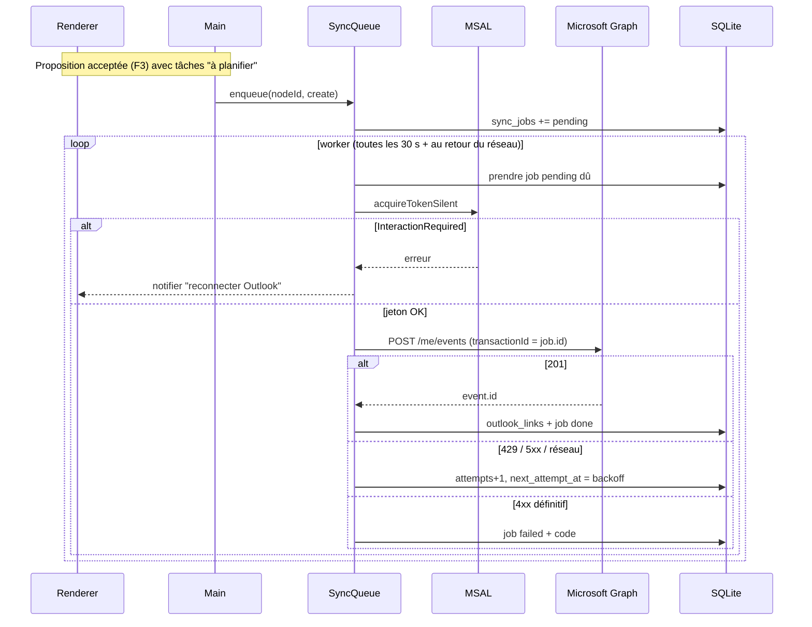

# Niveau 3 — Conception Technique : F6 — Synchro Outlook
> Basé sur : docs/brainstorm/L1-fondation.md + docs/brainstorm/L2-synchro-outlook.md
> Date : 2026-09-28 · Livraison : MVP-2

## 1. Contrat API

### 1a. Canaux IPC
| Canal | Entrée | Sortie | Codes d'erreur |
|-------|--------|--------|-----------------|
| `outlook:status` | — | `{ connected: boolean, accountLabel?: string, pending: number, failed: number }` | — |
| `outlook:connect` | — | `{ connected: true, accountLabel }` | `CONSENT_DENIED`, `AUTH_TIMEOUT`, `NETWORK` |
| `outlook:disconnect` | — | `{ ok }` | — |
| `outlook:enqueue` | `{ nodeId, action: "create" \| "update" \| "delete" }` | `SyncJob` | `NOT_CONNECTED`, `NOT_FOUND`, `VALIDATION` |
| `outlook:retry` | `{ jobId }` | `SyncJob` | `NOT_FOUND` |

`accountLabel` = nom affiché renvoyé par Microsoft, affiché dans l'app uniquement ; **jamais écrit dans le repo ni les logs**.

### 1b. Authentification — MSAL Node (`@azure/msal-node`)
- **Application** enregistrée une fois dans Microsoft Entra : type *client public* (pas de secret),
  comptes pris en charge : **comptes Microsoft personnels uniquement** ; redirection `http://localhost` (loopback).
- **Autorité** : `https://login.microsoftonline.com/consumers`.
- **Flux** : `PublicClientApplication.acquireTokenInteractive({ scopes, openBrowser })` — ouvre le navigateur
  système, **PKCE** (Proof Key for Code Exchange — preuve à usage unique qui empêche un tiers de réutiliser
  le code d'autorisation intercepté) et serveur loopback gérés par MSAL.
- **Renouvellement** : `acquireTokenSilent({ account, scopes })` avant chaque appel ; échec `InteractionRequired` → statut « reconnecter ».
- **Scopes** : `Calendars.ReadWrite` (+ `offline_access`, `openid`, `profile` ajoutés par MSAL). Rien d'autre.
- **Cache de jetons** : `@azure/msal-node-extensions` (persistance chiffrée DPAPI, portée utilisateur courant)
  dans `%APPDATA%/gestionnaire-idees/`. Jamais en clair, jamais dans SQLite, jamais dans le renderer.
- **Client ID** : lu depuis la config de build (`.env` non versionné + `.env.example` fictif) — ce n'est pas un
  secret (client public) mais on évite de lier le repo public à une app Entra personnelle.

### 1c. Microsoft Graph (v1.0)
| Opération | Requête | Corps / notes |
|-----------|---------|---------------|
| Créer | `POST /me/events` | `subject`, `start`/`end` (`dateTime` + `timeZone: "Europe/Brussels"`) ou `isAllDay`, `body` (texte court, lien de retour vers l'app), `categories: ["Gestionnaire idées"]`, `isReminderOn`, `reminderMinutesBeforeStart`, **`transactionId` = id du job** (évite les doublons en cas de rejeu) |
| Modifier | `PATCH /me/events/{id}` | champs modifiés uniquement |
| Supprimer | `DELETE /me/events/{id}` | après confirmation utilisateur |
Réponses traitées : 201/200/204 OK ; 401 → renouvellement silencieux puis reconnexion ; 404 → événement disparu (lien retiré) ;
429/503 → respect de `Retry-After` ; 4xx autres → échec définitif avec message.

## 2. Schéma de données détaillé
| Table | Colonnes | Contraintes | Index |
|-------|----------|-------------|-------|
| `outlook_links` | node_id (PK), event_id, last_synced_at, last_hash | 1 lien max par nœud | event_id |
| `sync_jobs` | id (uuid), node_id, action, payload_json, status, attempts, next_attempt_at?, last_error_code?, created_at, done_at? | status ∈ {pending, running, done, failed, cancelled} ; attempts ≤ 6 | (status, next_attempt_at), node_id |

`payload_json` = instantané calculé au moment de l'enfilage (titre, dates, rappel) — **aucun montant**
sauf si mentalyas l'a ajouté explicitement au texte de la tâche (R5 de L2).

## 3. Diagramme de séquence (Mermaid)

## 4. Cas limites techniques
- **Concurrence :** un seul worker ; un nouveau job `update` sur un nœud annule (`cancelled`) un `update` encore pending
  du même nœud (le dernier état gagne). Un `delete` annule tout create/update pending du nœud.
- **Idempotence :** `transactionId` Graph = id du job → un rejeu de création ne duplique pas l'événement ;
  `update` porte un hash du contenu (`last_hash`) → pas d'appel si rien n'a changé.
- **Backoff :** 30 s, 2 min, 10 min, 1 h, 6 h, 24 h puis `failed` (visible dans l'app, relance manuelle).
- **Fuseaux horaires :** stockage des dates en ISO local + fuseau `Europe/Brussels` explicite ; gestion heure d'été via le fuseau Graph.
- **Tâche sans heure :** événement « journée entière ».
- **Transactions :** l'enfilage des jobs fait partie de la transaction d'acceptation (F3) → pas de tâche validée sans job.
- **Déconnexion :** jobs pending conservés (statut « en attente de connexion ») ; cache MSAL supprimé.
- **Volumétrie :** faible (quelques événements/jour) ; aucun risque de throttling hors bug de boucle — plafond de sécurité : 60 appels Graph / heure.

## 5. Sécurité spécifique à cette fonctionnalité
| Risque | Vecteur | Mitigation |
|--------|---------|------------|
| Vol de jetons | Fichier de cache, logs, renderer | Cache MSAL chiffré DPAPI ; jetons uniquement dans le main ; logger en liste blanche |
| Interception du code d'autorisation | Redirection loopback | PKCE (géré par MSAL) ; port loopback éphémère |
| Privilèges excessifs | Scopes larges (Mail, Files…) | `Calendars.ReadWrite` seulement ; revue à chaque ajout de scope |
| Écriture non voulue | Bug / IA | Enfilage uniquement après validation F3 ; suppression toujours confirmée |
| Fuite financière | Montants dans le calendrier (synchronisé sur le téléphone, partageable) | Payload sans montants par défaut |
| Exposition de l'identité dans le repo public | Client ID / adresse | Client ID via `.env` non versionné ; adresse jamais stockée hors cache MSAL chiffré |
| Données Graph non fiables | Réponse inattendue | Validation Zod des réponses Graph utilisées (id, dates) |
