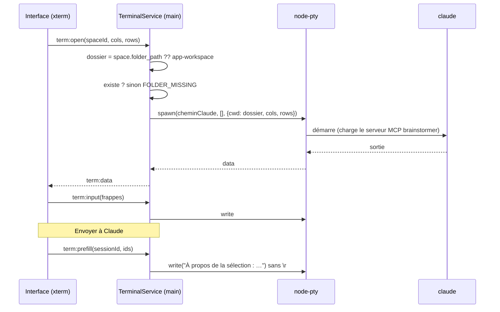

# Niveau 3 — Conception Technique : F12 Terminal intégré & espaces (+ F13)
> Basé sur : L1c-pont-claude-code.md + L2-terminal-espaces.md + L3-pont-mcp.md · Date : 2026-10-04

## 1. Contrat IPC
Le terminal est la frontière la plus sensible : l'interface ne choisit **jamais** le programme ni le dossier.

| Canal | Sens | Entrée | Sortie | Erreurs |
|-------|------|--------|--------|---------|
| `space:list` | interface → main | — | espaces (`id`, `name`, `linked`, `folderMissing`) — le chemin n'est pas renvoyé, seulement son nom de dossier | — |
| `space:create` | interface → main | `name` (1–80), `link: boolean` | espace créé (si `link`, le main ouvre lui-même le sélecteur natif) | `CANCELLED`, `INVALID_INPUT` |
| `space:relink` / `space:rename` / `space:archive` | interface → main | `id` (+ `name`) | espace | `NOT_FOUND` |
| `space:activate` | interface → main | `id` | — | `NOT_FOUND` |
| `term:open` | interface → main | `spaceId`, `cols`, `rows` | `sessionId` (réutilise la session vivante de l'espace) | `CLAUDE_NOT_FOUND`, `FOLDER_MISSING` |
| `term:input` | interface → main | `sessionId`, `data` (≤ 64 Ko) | — | `NOT_FOUND` |
| `term:resize` | interface → main | `sessionId`, `cols` (20–500), `rows` (5–200) | — | — |
| `term:restart` / `term:close` | interface → main | `sessionId` | — | — |
| `term:data` / `term:exit` | main → interface | `sessionId`, `data` / `code` | — | — |
| `term:prefill` | interface → main | `sessionId`, `selectionIds[]` | — : le main compose le texte (« À propos de la sélection : <titres> ») et l'écrit **sans retour chariot** | — |
| `integration:status` / `install` / `uninstall` / `test` | interface → main | — | état ; `install` renvoie d'abord le **plan** (commandes, fichiers) puis attend `confirm: true` | `CLAUDE_NOT_FOUND`, `FAILED` (message du CLI) |

Validation Zod sur chaque canal (principe I) ; `data` limité ; `sessionId` opaque (UUID) connu du seul main.

## 2. Schéma de données détaillé
| Table | Colonnes | Contraintes | Index |
|-------|----------|-------------|-------|
| `spaces` (nouvelle) | `id` text PK, `name` text not null, `folder_path` text null, `position` integer, `created_at`, `archived_at` | `name` 1–80 | `spaces_position_idx` |
| `neurons` | + `space_id` text (racines seulement ; les sous-neurones suivent `root_id`) | → `spaces.id` | `neurons_space_idx` |
| `canvas_blocks` | + `space_id` text not null | → `spaces.id` | `canvas_blocks_space_idx` |
| `map_links` | (pas de colonne : espace déduit des extrémités) | — | — |
| `settings` | `active_space_id` | — | — |
- Migration `0019_spaces` : crée l'espace « Général » (id fixe `general`), y range toutes les racines et blocs ;
  down : retire les colonnes et la table.
- Liens idée↔idée entre espaces différents : interdits par MCP et par l'interface (un espace = une carte).

## 3. Diagramme de séquence (Mermaid)

## 4. Cas limites techniques
- **Concurrence :** une session par espace ; changer d'espace détache l'affichage sans tuer la session (tampon des
  derniers 200 Ko de sortie rejoué au rattachement). Au plus 6 sessions vivantes ; au-delà, la plus ancienne inactive
  est fermée (avertissement).
- **Idempotence :** `term:open` sur un espace qui a déjà une session renvoie la même.
- **Transactions / rollback :** migration des espaces en une transaction ; `integration:install` : si l'enregistrement
  MCP échoue, le skill n'est pas copié (et inversement, retrait de ce qui a été fait).
- **Volumétrie :** flux du terminal regroupé par trames de 16 ms vers l'interface (pas d'IPC par octet).
- **Fermeture de l'app :** toutes les sessions sont tuées proprement (`before-quit`).
- **Module natif :** `node-pty` recompilé pour l'ABI d'Electron (`electron-rebuild`, déjà nécessaire pour
  `better-sqlite3`) ; mode ConPTY de Windows.
- **Dossier de travail de l'app :** `%APPDATA%/gestionnaire-idees/workspace/` avec un `CLAUDE.md` versionné par l'app
  (réécrit si la version change, jamais si mentalyas l'a modifié — empreinte comparée).
- **Skill `brainstormer` (F13) :** `~/.claude/skills/brainstormer/SKILL.md` copié depuis les ressources de l'app ;
  contenu : déclencheurs (« travaillons dans le brainstormer », « montre-moi ça sur la carte »), appel `etat`, conduite
  « visuel d'abord ». Désinstallation = suppression de ce dossier uniquement (vérifié par empreinte : pas de
  suppression d'un dossier modifié par mentalyas sans le dire).

## 5. Sécurité spécifique à cette fonctionnalité
| Risque | Vecteur | Mitigation |
|--------|---------|------------|
| Exécution de commande arbitraire | IPC du terminal | Le main lance **uniquement** le chemin de `claude` résolu par lui ; aucun argument venant de l'interface ; pas d'interpréteur intermédiaire |
| Dossier arbitraire | `space:create` | Le chemin vient **uniquement** du sélecteur natif ouvert par le main ; jamais renvoyé à l'interface |
| Interface compromise (XSS) qui tape dans le terminal | `term:input` | Risque résiduel accepté : équivaut à un clavier ; les permissions de Claude Code restent (demandes affichées) ; CSP stricte existante de l'interface comme première barrière |
| Séquences d'échappement malveillantes dans la sortie | `term:data` | Rendu par xterm (pas de HTML) ; liens cliquables ouverts via `shell.openExternal` après filtre `https:` |
| Modification de la config de Claude Code | `integration:install` | Plan affiché puis confirmation explicite ; commandes `claude mcp add/remove` officielles (pas d'édition directe de `~/.claude.json`) ; désinstallable |
| Données de la carte dans un dossier de projet | Contexte | L'app n'écrit jamais dans un dossier lié (R5 L2) |

## 6. Nouvelles dépendances (à confirmer au plan de la spec)
| Paquet | Rôle | Remarque |
|--------|------|----------|
| `@modelcontextprotocol/sdk` | Serveur MCP (F10) | Officiel, TypeScript |
| `@xterm/xterm` + `@xterm/addon-fit` | Affichage du terminal | Utilisé par VS Code |
| `node-pty` | Pseudo-terminal | Natif, recompilé pour Electron ; maintenu par Microsoft |
