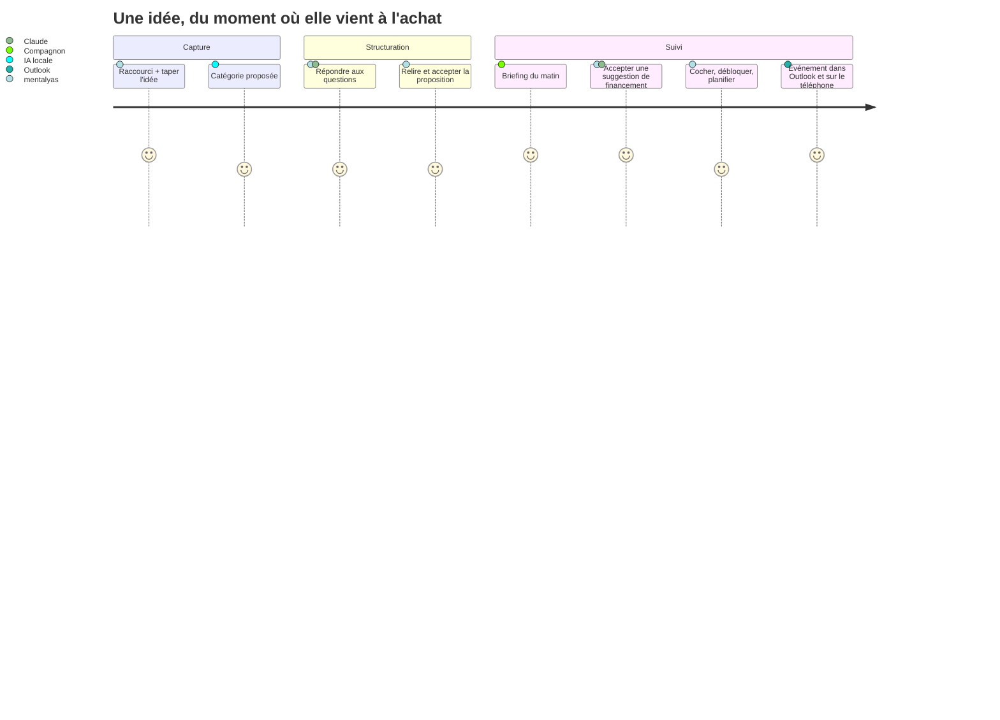

# Niveau 4 — UX / Parcours Utilisateur
> Projet : Gestionnaire_idées
> Basé sur : docs/brainstorm/L1-fondation.md + toutes les fonctionnalités niveau 2 (+ L3 pour les contraintes)
> Date : 2026-09-28

> Principes appliqués (standards mentalyas) : navigation à gauche, configuration à droite (⚙),
> **1 CTA par écran**, split φ 62/38 (contenu / détail), grille 8 px, feedback < 200 ms,
> 100 % utilisable au clavier, WCAG AA, dark/light.

## 1. Parcours principaux

### P0 — Premier lancement (onboarding, une fois)
| Étape | Écran | Action utilisateur | Fonctionnalité liée |
|-------|-------|---------------------|----------------------|
| 1 | Bienvenue | Découvre le concept + l'œuf du compagnon | F8 |
| 2 | IA locale | L'app détecte Ollama et le modèle ; sinon instructions pas à pas + « Revérifier » | F9 |
| 3 | Claude (facultatif) | Colle sa clé API (masquée), teste, fixe le plafond (10 €/mois proposé) | F9 |
| 4 | Profil | Aperçu du profil importé depuis Claude Code (ou « plus tard ») → Valider | F9 |
| 5 | Raccourci | Choisit/valide `Ctrl+Alt+Espace`, **essaie-le tout de suite** | F1 |
| 6 | Outlook (facultatif) | « Connecter » → navigateur Microsoft → retour « Connecté » | F6 |
| 7 | Fin | « Capture ta première idée » → ouvre le widget | F1 |

### P1 — Capture éclair (quotidien, le plus fréquent)
| Étape | Écran | Action utilisateur | Fonctionnalité liée |
|-------|-------|---------------------|----------------------|
| 1 | (n'importe quelle app) | `Ctrl+Alt+Espace` | F1 |
| 2 | Widget de capture | Tape « acheter un 2e écran » → `Entrée` | F1 |
| 3 | Widget (confirmation < 1 s) | Rien — le widget se ferme, le focus revient | F1 |
| 4 | (tâche de fond) | L'IA locale catégorise « Achat » ; le compagnon gagne +1 | F1, F8 |

### P2 — Idée → tâches (le cœur)
| Étape | Écran | Action utilisateur | Fonctionnalité liée |
|-------|-------|---------------------|----------------------|
| 1 | App › Idées | Clique « Structurer » sur une idée brute (ou `Ctrl+Entrée` dans le widget) | F2 |
| 2 | Questionnaire | Répond aux questions une par une (boutons rapides ou texte) | F2 |
| 3 | Questionnaire | Signale la mission mariage → l'IA propose une opportunité liée | F2 |
| 4 | Questionnaire | « J'ai assez d'éléments » → Décomposer | F2 |
| 5 | Revue de proposition | Relit l'arbre, corrige un montant, décoche une tâche → **Accepter** | F3 |
| 6 | Organigramme | Voit l'idée dépliée, liée à l'opportunité | F4 |
| 7 | (si tâches « à planifier ») | Événements envoyés à Outlook | F6 |

### P3 — Briefing du matin
| Étape | Écran | Action utilisateur | Fonctionnalité liée |
|-------|-------|---------------------|----------------------|
| 1 | Bureau | Allume le PC → le compagnon apparaît en bas à droite | F8 |
| 2 | Bulle du compagnon | Lit : 3 tâches aujourd'hui · 1 idée qui dort · 1 suggestion | F8, F7 |
| 3 | Bulle | Clique la suggestion → Revue de proposition | F3 |
| 4 | Revue | Accepte / refuse (+ raison) | F3, F7 |
| 5 | Bulle | « Merci, à plus tard » → il se range | F8 |

### P4 — Avancer dans son plan
| Étape | Écran | Action utilisateur | Fonctionnalité liée |
|-------|-------|---------------------|----------------------|
| 1 | Planning › Aujourd'hui | Voit les tâches prêtes et les retards | F5 |
| 2 | Planning | Coche « Chercher un modèle d'écran » → la tâche suivante se débloque | F5, F4 |
| 3 | Organigramme | À la condition « J'ai l'argent ? », choisit « Non » → branche budget active | F4 |
| 4 | Organigramme | Marque « Mission payée » comme déclencheur atteint → « Réserver X € » devient prête | F4 |
| 5 | Planning | Glisse « Acheter l'écran » sur samedi → « Envoyer à Outlook » | F5, F6 |

### P5 — Mettre à jour le cerveau de l'agent (via Claude Code)
| Étape | Écran | Action utilisateur | Fonctionnalité liée |
|-------|-------|---------------------|----------------------|
| 1 | (Claude Code) | Demande « mets à jour le contexte de mon secrétaire » → fichiers déposés | F9 |
| 2 | Notification app | « Nouveau contexte disponible » | F9 |
| 3 | Réglages › Contexte IA | Aperçu avant/après → **Appliquer** (ou Refuser) | F9 |

## 2. Inventaire des écrans
| Écran | Rôle | Fonctionnalités présentes |
|-------|------|----------------------------|
| **E1 — Widget de capture** | Saisie éclair, fenêtre sans bord au premier plan | F1 |
| **E2 — Compagnon + bulle** | Briefing, annonces, menu rapide | F8, F7 |
| **E3 — App › Idées** | Liste des idées, statuts, « Structurer » | F1, F2, F5 |
| **E4 — Questionnaire** | Dialogue IA question par question | F2, F9 |
| **E5 — Revue de proposition** | Aperçu arbre + liste des changements, éditer, Accepter/Refuser/Corriger | F3 |
| **E6 — Organigramme** | Carte interactive (62 %) + panneau détail (38 %) | F4 |
| **E7 — Planning** | Aujourd'hui / Semaine / Mois + retards | F5, F6 |
| **E8 — À valider** | File des propositions en attente (décompositions, suggestions) | F3, F7 |
| **E9 — Réglages** (⚙ à droite) | IA (clés, modèles, budget), Contexte IA, Outlook, Raccourci, Compagnon, Apparence | F9, F6, F1, F8 |
| **E10 — Historique** | Changements validés, annuler ; tirages d'évolution du compagnon | F3, F8 |
| **E11 — Onboarding** | Parcours P0 | F1, F6, F8, F9 |

Navigation latérale gauche de l'app complète : **Idées · À valider (badge) · Organigramme · Planning · Historique** — 5 entrées (Hick-Hyman / Miller). Réglages : ⚙ en haut à droite.

### Maquettes filaires (ASCII)

**E1 — Widget de capture**
```
┌──────────────────────────────────────────────────────┐
│ 💡  Une idée ?                                        │
│ ┌──────────────────────────────────────────────────┐ │
│ │ acheter un 2e écran pour le PC_                   │ │
│ └──────────────────────────────────────────────────┘ │
│ Entrée : noter · Ctrl+Entrée : structurer · Échap     │
└──────────────────────────────────────────────────────┘
```

**E4 — Questionnaire**
```
┌ Idées ┐ ┌──────────────────────────────────────────────┐
│À valid│ │ Acheter un 2e écran            [Achat] Q 3/8 │
│Organi.│ │──────────────────────────────────────────────│
│Plann. │ │ 🤖 As-tu déjà l'argent pour l'acheter ?       │
│Histo. │ │    [ Oui ]  [ Non ]  [ En partie ]           │
│       │ │    ou écris ta réponse…            [Je ne sais pas] │
│       │ │──────────────────────────────────────────────│
│       │ │ Déjà dit : modèle 27" · ~250 € · Coolblue    │
│       │ │                        [ Décompose maintenant ] │
└───────┘ └──────────────────────────────────────────────┘
```

**E5 — Revue de proposition**
```
┌──────────────────────────────────────────────────────────────┐
│ Proposition — Acheter un 2e écran          IA · il y a 1 min │
│───────────────────────────────┬──────────────────────────────│
│  Aperçu (arbre)               │ Changements                  │
│   [Idée]                      │ ☑ ➕ Chercher un modèle       │
│    ├─ Chercher un modèle      │ ☑ ➕ Noter prix + magasin     │
│    ├─ Noter prix + magasin    │ ☑ ➕ ◇ J'ai l'argent ?        │
│    └─ ◇ J'ai l'argent ?       │ ☑ ➕ € Mission mariage 1 250 │
│        ├ Oui → Date d'achat   │ ☐ ➕ Épargner 50 €/mois       │
│        └ Non → Budget …       │ ✏️ cliquer pour modifier      │
│───────────────────────────────┴──────────────────────────────│
│ [Refuser]  [Corriger…]                         [ Accepter ▶ ] │
└──────────────────────────────────────────────────────────────┘
```

**E6 — Organigramme (split φ 62/38)**
```
┌ nav ┐┌──────────── carte (62 %) ────────────┐┌── détail (38 %) ──┐
│     ││  [Écran PC]──finance──[Mission 💰]    ││ ◇ J'ai l'argent ? │
│     ││     │                                 ││ Branche : ( ) Oui │
│     ││   ◇ argent ?                          ││           (•) Non │
│     ││   ├ Oui (grisé)                       ││ Dépend de : —     │
│     ││   └ Non → Réserver X € 🔒             ││ [Ouvrir l'idée]   │
│     ││                          [mini-carte] ││                   │
└─────┘└───────────────────────────────────────┘└───────────────────┘
```

**E2 — Compagnon + bulle (bas droite de l'écran)**
```
                         ┌───────────────────────────────┐
                         │ Salut ! Aujourd'hui :          │
                         │ • 3 tâches ▸                   │
                         │ • « Portfolio » dort depuis 9 j ▸│
                         │ • 💡 La mission peut financer  │
                         │   l'écran ▸                    │
                         │        [Merci, à plus tard]    │
                         └──────────────┬────────────────┘
                                   ▄▀▀▄
                                  █ ◕◕ █   (pixel art, stade Ado)
                                   ▀▄▄▀
```

## 3. Diagramme de parcours (Mermaid)


## 4. Points de friction identifiés
- **Onboarding lourd** (Ollama, clé API, Outlook, profil) → seules les étapes IA locale + raccourci sont obligatoires ; Claude, profil et Outlook sont « plus tard » et rappelés discrètement par le compagnon.
- **Ollama non installé** → détection + instructions pas à pas + bouton « Revérifier » ; l'app reste utilisable (capture sans catégorie).
- **Questionnaire perçu comme un interrogatoire** → max 8 questions, réponses rapides, « Décompose maintenant » toujours visible, compteur Q 3/8.
- **Revue trop chargée pour un grand arbre** → changements groupés par branche, repliables ; « tout cocher/décocher » par branche.
- **File « À valider » qui s'accumule** → badge + rappel dans le briefing ; propositions périmées retirées automatiquement après 14 jours (archivées, récupérables).
- **Organigramme illisible avec beaucoup d'idées** → vue d'ensemble repliée par défaut, filtres, focus sur une idée + voisines, mini-carte.
- **Compagnon intrusif** (effet Clippy) → 1 briefing/jour, annonces discrètes (animation, pas de pop-up), report en plein écran, « ranger pour aujourd'hui ».
- **Latence Claude** pendant le questionnaire → indicateur « réfléchit… » immédiat (< 200 ms), effort `low` pour les questions, cache du contexte.
- **Conflit de raccourci global** → test à l'onboarding + choix alternatif immédiat.
