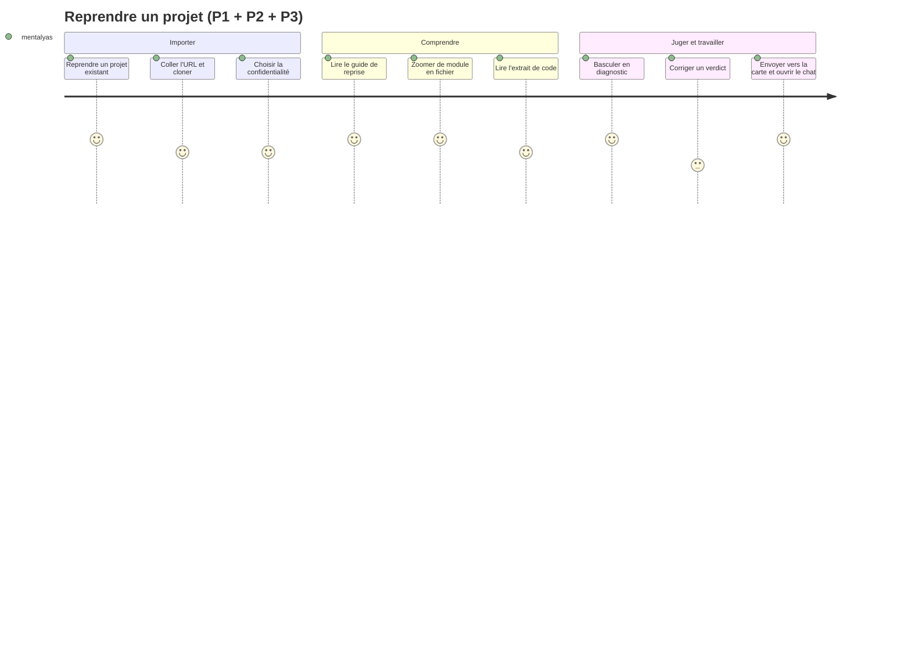

# Niveau 4 (amendement) — Parcours écran : reprendre un projet existant
> Projet : Gestionnaire_idées · Basé sur : L1f-reprise-projet.md, L2-reprise-*.md (R1 à R6), L3-reprise-*.md
> Amende : L4-parcours.md, L4b-neurones.md · Référence visuelle : image conceptuelle Gemini (4 niveaux de zoom),
> `docs/brainstorm/Assets/Capture d'écran 2026-10-06 185812.png` · Date : 2026-10-06 · Règles : `docs/claude/ergonomie-ui.md`

## 1. Parcours principaux

### P1 — Premier contact : « Je rejoins l'équipe, je reçois l'URL du dépôt » (MVP 1)
| Étape | Écran | Action utilisateur | Fonctionnalité liée |
|-------|-------|---------------------|----------------------|
| 1 | E1 Accueil de la carte | « Reprendre un projet existant » | R1 |
| 2 | E2 Assistant · Source | Colle l'URL, choisit le dossier parent (sélecteur natif) | R1 UC-2 |
| 3 | E2 Assistant · Clone | Suit la progression (Annuler possible) | R1 |
| 4 | E2 Assistant · Aperçu | Lit langages, fichiers, exclusions (« 3 fichiers sensibles ignorés ») | R1 UC-1 |
| 5 | E2 Assistant · Confidentialité | Choisit « Claude autorisé » ou « Local uniquement » → « Importer » | R1 UC-3 |
| 6 | E3 Analyse en cours | Voit la progression ; peut déjà ouvrir l'explorateur (arborescence) | R2 |
| 7 | E5 Guide de reprise | S'ouvre à la fin de l'analyse : lit « En une phrase », « Architecture », « Par où commencer » | R4 |
| 8 | E4 Explorateur | Clique un module cité dans le guide → explorateur centré dessus | R3, R4 UC-2 |

### P2 — Comprendre un module (MVP 1)
| Étape | Écran | Action utilisateur | Fonctionnalité liée |
|-------|-------|---------------------|----------------------|
| 1 | E4 Explorateur · niveau 1 | Repère « Billing » (flèches épaisses = beaucoup d'appels) | R3 UC-1 |
| 2 | E4 · panneau | Lit l'analogie et « qui l'appelle / qui il appelle » | R3 UC-2 |
| 3 | E4 · niveau 2 → 3 | Molette ou double-clic ; fil d'Ariane en haut | R3 UC-1 |
| 4 | E4 · filtres | Laisse la plomberie masquée ; « Isoler » sur `InvoiceService` | R3 UC-3 |
| 5 | E4 · niveau 4 | Lit l'extrait de `CalculateTotal()` dans le panneau code | R3 |

### P3 — Juger puis travailler (MVP 2)
| Étape | Écran | Action utilisateur | Fonctionnalité liée |
|-------|-------|---------------------|----------------------|
| 1 | E4 · bascule « Diagnostic » | Les couleurs passent des catégories aux verdicts (icône + libellé) | R5 |
| 2 | E7 À surveiller | Ouvre la liste : « Intouchable + Fragile » en tête | R5 UC-4 |
| 3 | E4 · panneau, onglet Diagnostic | Lit verdict, justification, mesures ; corrige si besoin | R5 UC-2, UC-3 |
| 4 | E4 · panneau | « Envoyer vers la carte de structure » | R6 UC-1 |
| 5 | E6 Carte de structure | L'élément apparaît ; double-clic → conversation, plan d'attaque | R6 UC-3 |
| 6 | E6 → E4 | « Voir dans l'explorateur » pour revoir le contexte | R6 UC-2 |

### P4 — Changer la confidentialité
| Étape | Écran | Action utilisateur | Fonctionnalité liée |
|-------|-------|---------------------|----------------------|
| 1 | Badge (E4, E5, E6, chat) | Clic sur le badge « Local uniquement » | R1 UC-3 |
| 2 | Boîte de confirmation | Lit la conséquence, confirme « Autoriser Claude » | R1 UC-3 |

## 2. Inventaire des écrans
| Écran | Rôle | Fonctionnalités présentes |
|-------|------|----------------------------|
| **E1** Accueil de la carte (existant) | Point d'entrée | Bouton « Reprendre un projet existant » à côté de « Nouvelle idée » (même rang, deux chemins symétriques : idée → projet / projet → compréhension) |
| **E2** Assistant d'import (fenêtre modale, 3 étapes) | Faire entrer un projet | Source (dossier / URL) · Aperçu · Confidentialité ; **un seul bouton principal par étape** ; aucune option de confidentialité présélectionnée |
| **E3** Analyse en cours (bandeau dans E4) | Feedback | Phase, `1 240 / 3 100 fichiers`, Annuler ; l'arborescence est déjà navigable |
| **E4** Explorateur | Comprendre | Carte à gauche (**62 %**) + panneau de détail à droite (**38 %**, onglets Résumé · Code · Diagnostic) ; bandeau : fil d'Ariane · recherche · filtres · bascule Catégories / Diagnostic · « Vue liste » · badge de confidentialité ; **indicateur de niveau 1-2-3-4** (Modules · Dossiers · Fichiers · Code) cliquable ; légende repliable en bas (traits plein / tirets / pointillés, couleurs + icônes) |
| **E5** Guide de reprise | Comprendre vite | Document du genesis (spec 012) ; mini-carte dans « Architecture » ; liens vers E4 ; « Régénérer » ; bandeau « rédigé par le modèle local » si besoin |
| **E6** Carte de structure (existant, spec 009) | Travailler | + verdict sur les éléments envoyés, « Voir dans l'explorateur », état « disparu » |
| **E7** À surveiller (panneau latéral d'E4) | Prioriser | ≤ 50 éléments triés par danger ; clic → E4 centré |

## 3. Diagramme de parcours (Mermaid)

## 4. Direction visuelle
- **MVP** : thème et jetons actuels de l'app (clair / sombre). On reprend de l'image de référence sa **structure**,
  pas encore son esthétique :
  - l'**indicateur de niveau** façon curseur de zoom (« Zoom 1 · 2 · 3 · 4 ») ;
  - un **panneau Code** monospace, fond sombre, numéros de ligne, qui rappelle le terminal du niveau 4 ;
  - des **flèches dont l'épaisseur** dit le volume d'appels (les « autoroutes » de la Journey Map).
- **v3** : direction « rétro-néo-futuriste » complète (nébuleuses, particules lumineuses, terminal phosphorescent),
  avec le plan B de rendu WebGL (L3-reprise-explorateur §0) ; toujours avec « animations réduites » respecté.

## 5. Points de friction identifiés
- Analyse longue sur un gros projet → l'arborescence est navigable tout de suite (E3 en bandeau), et le guide arrive dès
  la fin de l'analyse, sans attendre le diagnostic (MVP 2, lancé séparément).
- Vocabulaire nouveau (catégories, provenance, verdicts) → légende repliable, analogies dans le panneau, glossaire du
  guide (A8).
- « Local uniquement » désactive le chat → le bouton reste visible mais grisé, avec la raison et le lien vers le
  badge (pas de fonction qui disparaît sans explication).
- Trop de nœuds → regroupement « + 42 fichiers » et invitation à zoomer ou filtrer, plutôt qu'une carte illisible.
- Couleurs seules illisibles (daltonisme, écran en plein soleil) → icône + libellé partout, vue liste équivalente.
- Peur de casser le projet de l'employeur → rappel dans l'aperçu : « rien du projet ne sera exécuté ni modifié ».
