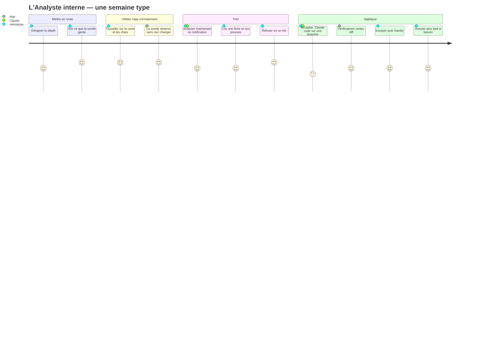

# Niveau 4 (amendement) — Parcours écran : l'Analyste interne
> Projet : Gestionnaire_idées · Basé sur : L1g-analyste-interne.md, L2-analyste-*.md (AN-A à AN-D), L3-analyste-*.md
> Amende : L4-parcours.md · Code lu : `app/AppShell.tsx` (navigation à gauche : Idées · À valider · Historique ;
> ⚙ Réglages), `pages/settings/` · Date : 2026-10-07 · Règles : `docs/claude/ergonomie-ui.md`

## 1. Parcours principaux

### P1 — Mettre en route (une fois)
| Étape | Écran | Action utilisateur | Fonctionnalité liée |
|-------|-------|---------------------|----------------------|
| 1 | E5 Réglages › Analyste | « Désigner le dépôt du Brainstormer » (sélecteur natif) | AN-A UC-1 |
| 2 | E5 | Lit le contrôle (« dépôt reconnu, l'app tourne depuis ce dépôt ») ; la sonde s'active, témoin vert | AN-A UC-1 |
| 3 | E5 | Ouvre « Ce que la sonde garde » : exemple d'événement réel, la liste de ce qui n'est **jamais** gardé | AN-A UC-3 |
| 4 | Navigation | L'entrée **Analyste** apparaît dans la navigation de gauche | — |

### P2 — Analyser et trier (cœur, quotidien)
| Étape | Écran | Action utilisateur | Fonctionnalité liée |
|-------|-------|---------------------|----------------------|
| 1 | E1 Boîte Analyste | « Analyser maintenant » (seul bouton principal) ; bandeau de progression : dossier → Claude → contrôle | AN-B UC-1 |
| 2 | E1 | Les fiches arrivent, triées par gravité ; filtre par catégorie (puces) | AN-B UC-2 |
| 3 | E2 Fiche (volet de droite, 38 %) | Lit constat → preuves (clés `obs:` dépliables, fichiers:lignes cliquables) → proposition → gain / risque | AN-B UC-2 |
| 4 | E2 | **Accepter** · Refuser (raison en un clic : « pas utile », « pas maintenant », « faux constat », ou texte) · Reporter | AN-B UC-2 |
| 5 | E2 | Optionnel : « Demander plus » → conversation avec la fiche en contexte | AN-B UC-2 |

### P3 — Appliquer, essayer, garder ou jeter
| Étape | Écran | Action utilisateur | Fonctionnalité liée |
|-------|-------|---------------------|----------------------|
| 1 | E2 | Accepter → si dépôt sale : message bloquant « commite ou range tes changements » (rien n'est créé) | AN-C UC-1 |
| 2 | E3 Mise à jour · Codage | Le volet devient la conversation Claude (worktree `analyste/…`) ; les commandes demandées s'affichent comme dans le chat | AN-C UC-1 |
| 3 | E3 | « Terminer » → commit + vérifications : 4 pastilles typecheck · lint · format · tests (en cours / ok / échec) | AN-C UC-1 |
| 4 | E3 · Prête | Lit le diff (fichiers à gauche, changements à droite) ; « Essayer » montre/lance `npm run dev` dans le worktree (terminal intégré) | AN-C UC-2 |
| 5 | E3 | **Garder** (actif seulement si 4 pastilles vertes ; confirmation « l'app va se recharger ») ou Jeter | AN-C UC-3 |
| 6 | E1 · onglet Gardées | Plus tard : « Annuler cette mise à jour » (confirmation) | AN-C UC-4 |

### P4 — Voir les propositions sur la carte
| Étape | Écran | Action utilisateur | Fonctionnalité liée |
|-------|-------|---------------------|----------------------|
| 1 | E4 Carte de structure du Brainstormer | Badge « 2 » sur un élément (icône Analyste + nombre) | AN-B UC-3 |
| 2 | E4 | Clic sur le badge → la fiche s'ouvre dans le volet (même E2) | AN-B UC-3 |
| 3 | E2 | « Voir dans la boîte » ↔ « Voir sur la carte » (aller-retour sans perdre la sélection) | — |

### P5 — Laisser l'app proposer d'elle-même
| Étape | Écran | Action utilisateur | Fonctionnalité liée |
|-------|-------|---------------------|----------------------|
| 1 | E5 Réglages › Analyste | Rythme : Désactivé · 1 h · 1 jour · 1 semaine ; seuil d'événements ; plafond de propositions | AN-D UC-1 |
| 2 | E5 | Lit « Prochaine analyse : demain 9 h, si ≥ 200 événements » | AN-D UC-1 |
| 3 | Toast + badge de navigation | « L'Analyste a 3 propositions » → clic → E1 | AN-D UC-2 |

## 2. Inventaire des écrans
| Écran | Rôle | Fonctionnalités présentes |
|-------|------|----------------------------|
| **E1** Boîte Analyste (nouvelle section de navigation, visible seulement si la sonde est active) | Trier vite | En-tête : dernière analyse (date, déclencheur), **Analyser maintenant** (1 CTA). Onglets : **À trier** (nouvelles + reportées) · **En cours** (codage, prêtes, à corriger) · **Gardées** · **Écartées** (refusées, jetées). Liste : icône de catégorie + libellé, titre, gravité (1–4, icône + mot), risque, fichiers (2 + « +3 »). Filtres par catégorie. Badge de navigation = nombre à trier |
| **E2** Fiche de proposition (volet droit 38 %, liste 62 %) | Décider | Constat · Preuves (observations dépliables, liens fichier:ligne → explorateur de la spec 017) · Proposition · Gain · Risque · Confiance · Fichiers visés · Accepter (primaire) / Refuser / Reporter / Demander plus |
| **E3** Mise à jour (même volet, état suivant de la fiche) | Construire et juger | Étapes en haut (Codage → Vérifications → Prête → Gardée) · conversation pendant le codage · pastilles de vérification · diff · Essayer · **Garder** (primaire) / Jeter · Annuler (sur une gardée) |
| **E4** Carte de structure (existante) | Situer | Badge Analyste sur `ElementNode` (icône + nombre, libellé accessible « 2 propositions de l'Analyste ») ; clic → E2 |
| **E5** Réglages › Analyste (nouvelle page, à côté de Claude Code) | Configurer | Dépôt désigné + contrôle · Sonde (active, nombre d'événements, conservation, « Effacer les observations ») · « Ce que la sonde garde » · Rythme, seuil, plafond · modèle. App installée : la page explique pourquoi l'Analyste est indisponible |
| **E6** Observations (sous-page de E5) | Transparence | Tableau filtrable (période, famille), compteurs, export JSON local |

## 3. Diagramme de parcours (Mermaid)

## 4. Points de friction identifiés
- **Trop de fiches à trier** → plafond 5 par analyse, refus en un clic avec raisons prêtes, saut de l'analyse
  automatique au-delà de 10 en attente (AN-D).
- **Preuves illisibles** (« obs:ia:2 ») → chaque clé s'affiche en phrase (« La tâche Catégoriser a rendu 23 fois la
  même réponse pour la même entrée ») ; la clé reste en petit pour la traçabilité.
- **Rechargement surprise après « Garder »** → confirmation qui le dit, état enregistré avant, retour sur la fiche
  « Gardée » au redémarrage.
- **Dépôt sale au moment d'accepter** → message qui dit quoi faire ; l'acceptation est mémorisée (la fiche reste
  « acceptée », « Reprendre » quand le dépôt est propre).
- **Essayer sans casser l'app ouverte** → « Essayer » lance la version de la branche sur le **profil démo** dans le
  terminal intégré, jamais à la place de l'app ouverte.
- **Où est l'Analyste ?** → section de navigation masquée tant que la sonde n'est pas active ; Réglages › Analyste
  toujours visible en développement, avec un texte qui explique comment l'activer.
- **Couleur seule** (gravité, catégories, pastilles) → toujours icône + libellé (WCAG AA (règles d'accessibilité du
  web, niveau AA), daltonisme).
