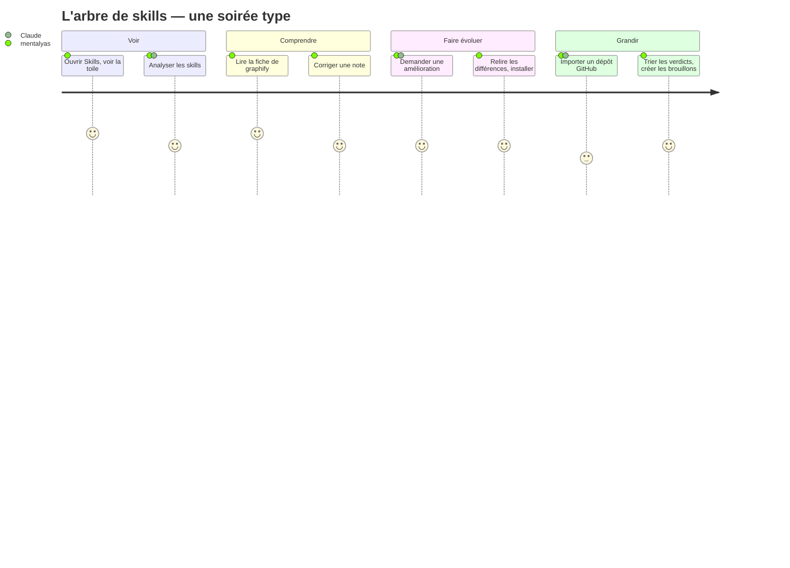

# Niveau 4 (amendement) — Parcours écran : l'arbre de skills
> Projet : Gestionnaire_idées · Basé sur : L1h-arbre-de-skills.md, L2-skills-*.md (SK-A à SK-D), L3-skills-*.md
> Amende : L4-parcours.md · Navigation existante : `AppShell` (Idées · À valider · Historique · Analyste ; ⚙ Réglages)
> Date : 2026-10-07 · Règles : `docs/claude/ergonomie-ui.md`

## 1. Parcours principaux

### P1 — Découvrir sa toile
| Étape | Écran | Action utilisateur | Fonctionnalité liée |
|-------|-------|---------------------|----------------------|
| 1 | Navigation | Clic sur **Skills** (toujours visible) | SK-A |
| 2 | E1 Arbre | Voit le tronc « Toi », les branches, les nœuds (nom, famille, ★, usage) ; filtres par famille, recherche | SK-A, SK-B |
| 3 | E1 | Bandeau d'accueil si aucune fiche : « Analyser les skills » (un bouton principal) → progression | SK-B |
| 4 | E1 | Les nœuds se rangent sur leurs branches de domaine, liens pointillés de Claude apparaissent | SK-B |

### P2 — Comprendre un skill
| Étape | Écran | Action utilisateur | Fonctionnalité liée |
|-------|-------|---------------------|----------------------|
| 1 | E1 | Clic sur `graphify` → le nœud et ses liens passent devant, les autres s'estompent | SK-A |
| 2 | E2 Fiche (volet droit 38 %) | Lit : résumé, Quand l'utiliser, Quand l'éviter, Déclencheurs, Entrées / sorties, Exemples ; grille de qualité (4 barres + justification) ; usage 30 j ; liens (appelle / appelé par / enchaîne vers…) | SK-B |
| 3 | E2 | Onglet « SKILL.md » : le texte source en lecture seule ; onglet « Fichiers » : annexes, repère ⚠ scripts | SK-A |
| 4 | E2 | Corrige les étoiles (clic sur la 4ᵉ ★) ou le domaine (menu) → notification « Annuler » | SK-B |

### P3 — Améliorer un skill avec Claude
| Étape | Écran | Action utilisateur | Fonctionnalité liée |
|-------|-------|---------------------|----------------------|
| 1 | E2 | Onglet **Conversation** du skill | SK-C |
| 2 | E2 | « Rends ses déclencheurs plus clairs » → Claude répond et dépose un **brouillon** (carte « Brouillon prêt ») | SK-C |
| 3 | E3 Brouillon (même volet) | Différences version installée / brouillon ; bouton **Installer** (principal), Jeter | SK-C |
| 4 | E3 | Installer → confirmation « change Claude partout » → nœud mis à jour, version précédente gardée | SK-C |
| 5 | E2 | Plus tard : « Revenir à la version précédente » (menu ⋯ de la fiche) | SK-C |

### P4 — Créer, combiner, apprendre
| Étape | Écran | Action utilisateur | Fonctionnalité liée |
|-------|-------|---------------------|----------------------|
| 1 | E1 | Clic dans le vide (aucune sélection) → volet droit = **Conversation « Skills »** | SK-C |
| 2 | E4 | « Je veux un skill pour préparer mes séances photo » / « Comment combiner brainstorm et pipeline ? » | SK-C |
| 3 | E4 | Claude propose ; un brouillon de nouveau skill apparaît dans l'arbre comme **nœud fantôme** (contour pointillé) | SK-C |
| 4 | E3 | Revue puis Installer → le fantôme devient un vrai nœud | SK-C |

### P5 — Importer depuis GitHub
| Étape | Écran | Action utilisateur | Fonctionnalité liée |
|-------|-------|---------------------|----------------------|
| 1 | E1 | Bouton **Importer depuis GitHub** (en-tête de la page) | SK-D |
| 2 | E5 Import (fenêtre modale) · Adresse | Colle l'adresse → « Analyser » ; progression : clone → repérage → analyse | SK-D |
| 3 | E5 · Choix | Liste des skills du dépôt : verdict (icône + libellé : ✓ sûr, ⚠ à revoir, ⛔ dangereux), raisons, fichiers, scripts décochés ; « dangereux » verrouillé | SK-D |
| 4 | E5 | Coche, « Créer les brouillons » → les nœuds fantômes apparaissent dans l'arbre | SK-D |
| 5 | E3 | Revue et Installer, un par un | SK-C |

## 2. Inventaire des écrans
| Écran | Rôle | Contenu |
|-------|------|---------|
| **E1** Arbre de skills (nouvelle section **Skills**) | Voir | En-tête : titre, compteur (« 107 skills · 3 familles »), recherche, puces de famille, **Analyser les skills**, **Importer depuis GitHub**. Carte : tronc « Toi », branches nommées, nœuds 208 × 104 (nom, icône de famille + libellé, ★ en icônes + nombre, usage « 12 / 30 j », ⚠ scripts, « abîmé »), liens pleins (appelle) / pointillés (de sens), nœuds fantômes (brouillons). Survol : liens du nœud mis en avant. |
| **E2** Fiche technique (volet droit 38 %) | Comprendre | Onglets **Fiche** · **SKILL.md** · **Fichiers** · **Conversation**. Fiche : résumé, Quand l'utiliser, Quand l'éviter, Déclencheurs, Entrées / sorties, Exemples, grille (4 barres + phrase), usage, liens cliquables, origine (famille, version de plugin, dépôt importé). Menu ⋯ : Revenir à la version précédente, Dupliquer en skill personnel (plugin), Réanalyser. |
| **E3** Brouillon (état du volet E2) | Décider | Bandeau « Brouillon de Claude » (ou « Import »), différences fichier par fichier, avertissement si le disque a changé, **Installer** (principal), Jeter. |
| **E4** Conversation « Skills » (volet droit sans sélection) | Brainstormer | Fil de la conversation générale, suggestions de départ (« Que me manque-t-il ? », « Quels skills combiner pour… ? »), cartes « Brouillon prêt » cliquables. |
| **E5** Import GitHub (fenêtre modale, 2 étapes) | Faire entrer | Adresse → progression → choix (verdicts, raisons citant les lignes, fichiers, scripts à cocher un par un, avertissements) → « Créer les brouillons » ; Annuler à tout moment. |

## 3. Diagramme de parcours (Mermaid)

## 4. Points de friction identifiés
- **Trop de nœuds** (90 skills de plugins) → famille « plugins » repliée par défaut en une grappe « 90 skills de
  plugins » ; dépliée au clic ou par le filtre.
- **Peur d'abîmer un skill** → « Installer » toujours précédé des différences, phrase « change Claude dans tous tes
  projets », versions et « Revenir » visibles dans le menu ⋯.
- **Verdicts mal compris** → icône + libellé + raisons citant la ligne ; « dangereux » verrouillé avec explication.
- **Analyse longue** → progression par skill, l'arbre reste utilisable, les fiches arrivent au fil de l'eau.
- **Où brainstormer ?** → clic dans le vide = conversation générale ; nœud sélectionné = sa conversation ; rappel discret
  en haut du volet.
- **Couleur seule** → familles, verdicts, étoiles : toujours icône + libellé (WCAG AA).
