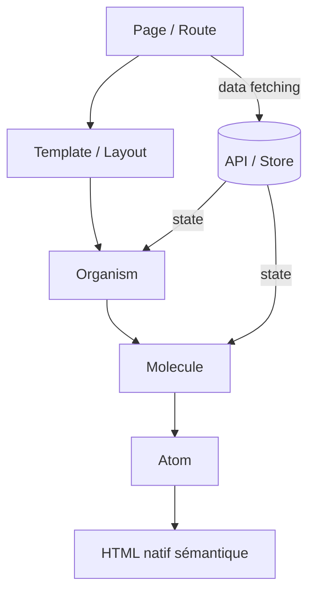

# Frontend Workflow — référence générale
> Stack : React + TypeScript + Tailwind CSS · Architecture : Atomic Design · Responsive : desktop-first.
> Ergonomie (lois cognitives, Gestalt, Nielsen, grille 8px, φ) : [`ergonomie-ui.md`](./ergonomie-ui.md).
>
> **Dans ce dépôt, le code existant prime** : l'interface (`src/renderer/src/`) range ses composants par
> fonctionnalité (`canvas/`, `chat/`, `pages/settings/`…) avec des atomes partagés dans `components/atoms/` ; ses
> couleurs sont les jetons du thème (`bg-surface`, `text-content-muted`, `text-accent`…). Ce guide sert pour les
> principes (accessibilité, jetons, état, nommage), pas pour réorganiser l'existant.

---

## 1. Architecture des fichiers — Atomic Design

```
src/
├── components/
│   ├── atoms/            # Éléments de base, non divisibles
│   │   ├── Button/
│   │   │   ├── Button.tsx
│   │   │   ├── Button.types.ts
│   │   │   └── index.ts
│   │   ├── Input/
│   │   ├── Icon/
│   │   ├── Badge/
│   │   ├── Spinner/
│   │   ├── Avatar/
│   │   └── Typography/   # Heading, Text, Label
│   │
│   ├── molecules/        # Combinaisons d'atoms avec une fonction unique
│   │   ├── FormField/    # Label + Input + ErrorMessage
│   │   ├── SearchBar/    # Input + Button
│   │   ├── Card/
│   │   ├── NavItem/
│   │   ├── Toast/
│   │   └── Dropdown/
│   │
│   ├── organisms/        # Sections complexes, réutilisables
│   │   ├── Header/
│   │   ├── Sidebar/
│   │   ├── Footer/
│   │   ├── Modal/
│   │   ├── DataTable/
│   │   └── Form/
│   │
│   └── templates/        # Structures de page sans données réelles
│       ├── AuthLayout/
│       ├── DashboardLayout/
│       ├── PublicLayout/
│       └── ErrorLayout/
│
├── pages/                # Vues connectées aux données (Next.js App Router ou React Router)
├── hooks/                # Custom hooks réutilisables
├── stores/               # State management (Zustand par défaut)
├── services/             # Appels API, logique externe
├── utils/                # Fonctions pures utilitaires
├── types/                # Types et interfaces TypeScript globaux
├── styles/               # CSS global, variables, tokens
│   ├── globals.css
│   ├── tokens.css        # Variables CSS (design tokens)
│   └── typography.css
└── assets/               # Images, SVGs statiques, fonts
```

### Règle des niveaux Atomic Design

| Niveau | Définition | Exemples | Contient de la logique ? |
|--------|-----------|----------|--------------------------|
| **Atom** | Élément indivisible | Button, Input, Icon, Badge | Non — seulement des props |
| **Molecule** | Combinaison d'atoms, une seule responsabilité | FormField, SearchBar, Card | Légère (validation locale) |
| **Organism** | Section complète, réutilisable | Header, Modal, DataTable | Oui (hooks, store) |
| **Template** | Structure de page, sans données réelles | DashboardLayout | Non — squelette seulement |
| **Page** | Template + données réelles | DashboardPage | Oui — data fetching ici |

---

## 2. Conventions de nommage

| Élément | Convention | Exemple |
|---------|-----------|---------|
| Composant | PascalCase | `UserCard.tsx` |
| Dossier composant | PascalCase | `UserCard/` |
| Hook | camelCase + préfixe `use` | `useAuth.ts` |
| Store | camelCase + suffixe `Store` | `authStore.ts` |
| Service | camelCase + suffixe `Service` | `userService.ts` |
| Util | camelCase | `formatDate.ts` |
| Type/Interface | PascalCase + suffixe `Type` ou `Props` | `UserType.ts`, `ButtonProps` |
| Constante | SCREAMING_SNAKE_CASE | `MAX_RETRY_COUNT` |
| CSS variable | kebab-case avec préfixe `--` | `--color-primary` |
| Fichier style | kebab-case | `global-styles.css` |

### Structure d'un composant (template)

```tsx
// Button/Button.tsx
import type { ButtonProps } from './Button.types'

export const Button = ({ label, variant = 'primary', onClick, disabled = false }: ButtonProps) => {
  return (
    <button
      className={buttonVariants({ variant })}
      onClick={onClick}
      disabled={disabled}
      type="button"
    >
      {label}
    </button>
  )
}

// Button/index.ts  ← export centralisé
export { Button } from './Button'
export type { ButtonProps } from './Button.types'
```

---

## 3. Design Tokens — Variables CSS

```css
/* styles/tokens.css */
:root {
  /* ═══ COULEURS ═══ */
  --color-primary:        #6366f1;
  --color-primary-hover:  #4f46e5;
  --color-secondary:      #ec4899;
  --color-success:        #10b981;
  --color-warning:        #f59e0b;
  --color-error:          #ef4444;
  --color-info:           #3b82f6;

  /* Surfaces (light par défaut) */
  --color-bg:             #ffffff;
  --color-surface:        #f9fafb;
  --color-surface-2:      #f3f4f6;
  --color-border:         #e5e7eb;
  --color-text:           #111827;
  --color-text-muted:     #6b7280;
  --color-text-inverse:   #ffffff;

  /* ═══ TYPOGRAPHIE ═══ */
  --font-sans:   'Inter', system-ui, sans-serif;
  --font-mono:   'JetBrains Mono', 'Fira Code', monospace;
  --font-display: var(--font-sans); /* Override si titre spécifique */

  --text-xs:   0.75rem;   /* 12px */
  --text-sm:   0.875rem;  /* 14px */
  --text-base: 1rem;      /* 16px */
  --text-lg:   1.125rem;  /* 18px */
  --text-xl:   1.25rem;   /* 20px */
  --text-2xl:  1.5rem;    /* 24px */
  --text-3xl:  1.875rem;  /* 30px */
  --text-4xl:  2.25rem;   /* 36px */

  --leading-tight:  1.25;
  --leading-normal: 1.5;
  --leading-loose:  1.75;

  /* ═══ ESPACEMENT ═══ */
  --space-1:  0.25rem;   /* 4px */
  --space-2:  0.5rem;    /* 8px */
  --space-3:  0.75rem;   /* 12px */
  --space-4:  1rem;      /* 16px */
  --space-6:  1.5rem;    /* 24px */
  --space-8:  2rem;      /* 32px */
  --space-12: 3rem;      /* 48px */
  --space-16: 4rem;      /* 64px */

  /* ═══ BORDER RADIUS ═══ */
  --radius-sm:   0.25rem;
  --radius-md:   0.5rem;
  --radius-lg:   0.75rem;
  --radius-xl:   1rem;
  --radius-full: 9999px;

  /* ═══ OMBRES ═══ */
  --shadow-sm:  0 1px 2px rgba(0,0,0,0.05);
  --shadow-md:  0 4px 6px rgba(0,0,0,0.07);
  --shadow-lg:  0 10px 15px rgba(0,0,0,0.1);
  --shadow-xl:  0 20px 25px rgba(0,0,0,0.1);

  /* ═══ TRANSITIONS ═══ */
  --transition-fast:   150ms ease;
  --transition-normal: 250ms ease;
  --transition-slow:   400ms ease;

  /* ═══ Z-INDEX ═══ */
  --z-dropdown:  100;
  --z-sticky:    200;
  --z-overlay:   300;
  --z-modal:     400;
  --z-toast:     500;
  --z-tooltip:   600;
}

/* Mode sombre */
.dark, [data-theme="dark"] {
  --color-bg:          #0f172a;
  --color-surface:     #1e293b;
  --color-surface-2:   #334155;
  --color-border:      #334155;
  --color-text:        #f1f5f9;
  --color-text-muted:  #94a3b8;
}
```

---

## 4. Typographie — Système Google Fonts

```css
/* styles/typography.css */
@import url('https://fonts.googleapis.com/css2?family=Inter:wght@400;500;600;700&family=JetBrains+Mono:wght@400;500&display=swap');

body {
  font-family: var(--font-sans);
  font-size: var(--text-base);
  line-height: var(--leading-normal);
  color: var(--color-text);
}

h1 { font-size: var(--text-4xl); font-weight: 700; line-height: var(--leading-tight); }
h2 { font-size: var(--text-3xl); font-weight: 700; line-height: var(--leading-tight); }
h3 { font-size: var(--text-2xl); font-weight: 600; }
h4 { font-size: var(--text-xl);  font-weight: 600; }
h5 { font-size: var(--text-lg);  font-weight: 500; }
h6 { font-size: var(--text-base); font-weight: 500; }

code, pre { font-family: var(--font-mono); }
```

---

## 5. Règles Tailwind + CSS Variables

```js
// tailwind.config.ts
export default {
  darkMode: 'class',
  theme: {
    extend: {
      colors: {
        primary:   'var(--color-primary)',
        secondary: 'var(--color-secondary)',
        surface:   'var(--color-surface)',
        border:    'var(--color-border)',
      },
      fontFamily: {
        sans:  'var(--font-sans)',
        mono:  'var(--font-mono)',
      },
      borderRadius: {
        sm: 'var(--radius-sm)',
        md: 'var(--radius-md)',
        lg: 'var(--radius-lg)',
      },
      transitionDuration: {
        fast:   '150ms',
        normal: '250ms',
        slow:   '400ms',
      },
    },
  },
}
```

### Règles d'utilisation Tailwind
- Les tokens CSS (`--color-primary`) sont la **source de vérité** — Tailwind les référence, pas l'inverse.
- Extraire en composant ou `@apply` si un groupe de classes est utilisé **3+ fois**.
- Ne jamais écrire de valeurs magiques (`text-[#3a3a3a]`) — utiliser les tokens.
- Préfixer `dark:` uniquement pour les overrides de surfaces et textes.

---

## 6. Responsive — Desktop-first

```
Breakpoints standards :
  2xl  ≥ 1536px  (grands écrans)
  xl   ≥ 1280px  (desktop standard)       ← point de départ du design
  lg   ≥ 1024px  (laptop)
  md   ≥  768px  (tablette)
  sm   ≥  640px  (grand mobile)
  xs      <640px (mobile — override final)
```

```tsx
// Ordre dans Tailwind : classe de base (desktop) → variantes réductives
<div className="grid grid-cols-3 lg:grid-cols-2 md:grid-cols-1">
```

### Règles responsive
- Tester sur 3 points minimum : 1440px, 768px, 375px.
- Les layouts skeleton (grilles, flex) doivent être définis dans les **templates**.
- Pas de `px` fixes pour les layouts — préférer `rem`, `%`, `vw/vh`.

---

## 7. Gestion de l'état

| Situation | Solution |
|-----------|---------|
| État local au composant | `useState` / `useReducer` |
| État partagé entre quelques composants | Props + Context React |
| État global (auth, thème, panier...) | **Zustand** (léger, TypeScript-friendly) |
| Données serveur + cache | **TanStack Query** (React Query) |
| Formulaires | **React Hook Form** + **Zod** pour la validation |

### Règle du lifting
- Ne lever l'état qu'**au niveau minimal nécessaire**.
- Si props drilling > 2 niveaux → envisager Context ou store.

---

## 8. Accessibilité (a11y) — Minimum WCAG AA

- Ratio de contraste : **4.5:1** texte normal, **3:1** texte large (≥18px bold).
- Tout élément interactif doit avoir un **focus visible** (`outline`, pas `outline: none` sans alternative).
- Images : `alt` descriptif obligatoire (ou `alt=""` si décoratif).
- HTML sémantique : `<button>` pour les actions, `<a>` pour la navigation.
- ARIA seulement quand le HTML natif ne suffit pas.
- Labels explicites sur tous les champs de formulaire (`<label for>`).
- Modales : focus trap obligatoire + fermeture `Escape`.

---

## 9. Performance frontend

- **Lazy loading** des composants lourds (`React.lazy` + `Suspense`).
- **Images** : format WebP/AVIF, dimensions explicites, `loading="lazy"`.
- **Fonts** : `display=swap`, précharger la police principale.
- **Bundle** : analyser avec `vite-bundle-visualizer` avant chaque mise en prod.
- Pas de dépendance npm pour ce qui peut s'écrire en 5 lignes.

---

## 10. Checklist avant livraison d'un composant

- [ ] TypeScript strict — pas de `any`
- [ ] Props documentées via interface/type
- [ ] Responsive vérifié (1440 / 768 / 375)
- [ ] Dark mode vérifié
- [ ] Contraste WCAG AA vérifié
- [ ] Focus visible testé au clavier
- [ ] Pas de valeurs magiques (couleurs, tailles en dur)
- [ ] Export propre via `index.ts`
- [ ] Nommage conforme aux conventions

---

## 11. Diagramme — Flux d'un composant React


