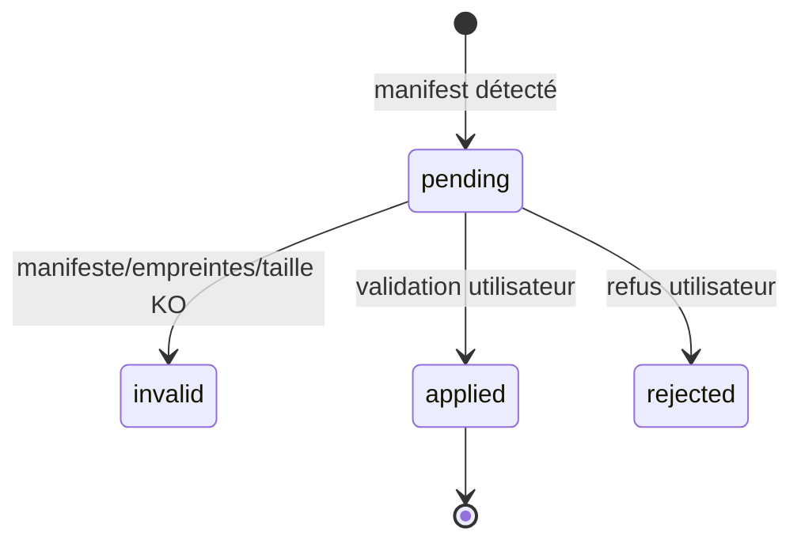

# Data Model — 001 Moteur IA hybride & contexte

> Base SQLite chiffrée (Drizzle). Secrets **hors base**. Aucune table ne stocke de contenu d'idée
> ou de réponse IA, sauf `examples` (contenu nécessaire à l'injection, chiffré au repos avec la base).

## Entités

### `ai_calls` — journal des appels (FR-007, FR-008)
| Champ | Type | Règles |
|-------|------|--------|
| id | text (uuid) | PK |
| request_id | text | idempotence (réutilisation de réponse 5 min, en mémoire) |
| kind | text | ∈ TaskKind |
| engine | text | `ollama` \| `claude` |
| model | text | |
| input_tokens / output_tokens / cache_read_tokens | integer | ≥ 0 |
| cost_millicents | integer | ≥ 0 (coût en millièmes de centime d'euro, évite les arrondis) |
| status | text | `ok` \| `invalid` \| `error` \| `refusal` \| `blocked_budget` |
| error_code | text? | |
| duration_ms | integer | |
| created_at | text (ISO) | index |
Index : `created_at`, `(engine, created_at)`.
**Coût du mois** = `SUM(cost_millicents) WHERE engine='claude' AND created_at >= début du mois local`.

### `ai_pending_requests` — file locale persistante (FR-013, analyse C1)
| Champ | Type | Règles |
|-------|------|--------|
| id | text (uuid) | PK |
| request_id | text | unique ; lien avec le demandeur |
| kind | text | ∈ TaskKind local |
| payload | text | entrée + nom du schéma attendu (chiffré avec la base) |
| attempts | integer | ≥ 0 ; > 5 → abandon, événement d'échec |
| created_at | text | ordre de rejeu (FIFO) |
Supprimée dès que la demande aboutit ou est abandonnée.

### `ai_config` — configuration (FR-008, FR-011, FR-013)
| Clé | Valeur par défaut | Validation |
|-----|-------------------|-----------|
| `local_model` | (résultat du banc R5) | chaîne non vide |
| `claude_model` | `claude-opus-5` | liste de modèles connus |
| `cap_cents` | 1000 | 0..100000 |
| `alert_ratio` | 0.8 | 0.5..0.95 |
| `allow_claude_fallback` | false | booléen |
| `budget_override_month` | null | `YYYY-MM` si déblocage manuel ce mois |
| `pricing` | grille R9 | schéma Zod |
| `usd_eur_rate` | 0.92 | 0.5..2 |
| `routing` | table FR-002 | chaque TaskKind → `ollama`\|`claude` |

### `context_versions` (FR-015, FR-016)
| Champ | Type | Règles |
|-------|------|--------|
| id | text | PK |
| version | integer | croissant |
| profile_md / rules_md | text | ≤ 50 Ko chacun |
| source | text | `seed` \| `import` |
| import_id | text? | FK `context_imports` |
| is_active | integer (bool) | **exactement une** ligne active (index unique partiel `WHERE is_active = 1`) |
| applied_at | text | |

### `context_imports` (FR-015)
| Champ | Type | Règles |
|-------|------|--------|
| id | text | PK |
| detected_at | text | |
| manifest_json | text | schéma manifest v1 |
| diff_json | text | différences avec la version active |
| status | text | `pending` → `applied` \| `rejected` \| `invalid` |
| error | text? | motif si `invalid` |

### `examples` (FR-017)
| Champ | Type | Règles |
|-------|------|--------|
| id | text | PK |
| polarity | text | `positive` \| `negative` |
| task_kind | text | ∈ TaskKind |
| content_json | text | `{ input, output, reason? }` validé |
| source | text | `accepted_proposal` \| `rejected_proposal` \| `import` |
| created_at | text | |
Règle : au-delà de 20 par `(task_kind)`, les plus anciens (hors `import`) sont supprimés.

## Types (non persistés)

```ts
type TaskKind = "categoriser" | "resumer" | "anonymiser" | "briefing_texte"          // → locale
              | "etendre" | "synthetiser" | "reviser" | "suggerer_liens" | "suggerer";  // → claude
type Engine = "ollama" | "claude";
type AIErrorCode = "AI_UNAVAILABLE" | "AI_INVALID_OUTPUT" | "AI_REFUSAL"
                 | "BUDGET_EXCEEDED" | "AUTH_FAILED" | "ANONYMIZATION_FAILED" | "QUEUED";
```

## Transitions d'état


Budget : `normal` → (`spent ≥ alert_ratio × cap`) `alerte` → (`spent ≥ cap`) `bloqué` → (déblocage manuel du mois) `débloqué` → (nouveau mois) `normal`.

## Stockage hors base
| Élément | Emplacement | Protection |
|---------|-------------|-----------|
| Clé API Claude | `%APPDATA%/gestionnaire-idees/secrets/claude.key` | `safeStorage` (DPAPI) |
| Clé de la base | `%APPDATA%/gestionnaire-idees/secrets/db.key` | `safeStorage` (DPAPI) |
| Dossier d'import | `%APPDATA%/gestionnaire-idees/context-inbox/` | validation + aperçu obligatoire |
| Cadre système | embarqué dans l'app (code, versionné) | non modifiable par import |
