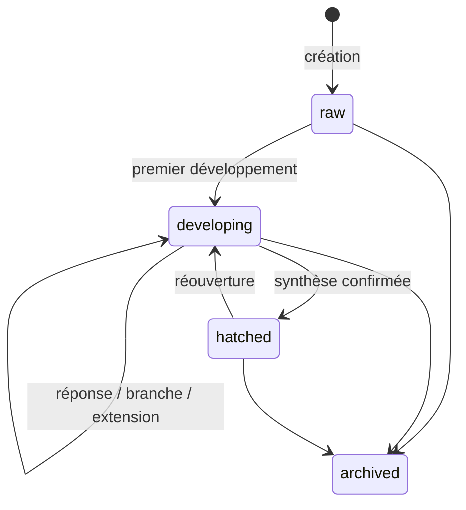

# Data Model — 002 Moteur de neurones (modèle central, v2)

> SQLite chiffré (Drizzle), migrations avec `down`. Remplace le modèle « idées / sessions / propositions » de la v1.
> Tables partagées par la spec 003 (interface) et le MVP-2 (planning, Outlook, conseiller).

## `categories`
| Champ | Type | Règles |
|-------|------|--------|
| id / slug | text | slug unique ; seed : `general`, `achat`, `projet`, `sortie`, `photo`, `it` |
| label / color / sort_order | text / text / int | couleurs AA clair + sombre |

## `neurons` (racines et sous-neurones)
| Champ | Type | Règles |
|-------|------|--------|
| id | text (uuid) | PK |
| root_id | text | = id pour une racine ; index |
| parent_id | text? | null pour une racine ; FK neurons |
| depth | integer | « growth depth » : 0 racine ; ≤ 6 pour une croissance IA (≠ « plan depth » ≤ 5 des `plan_nodes`) |
| kind | text | `root` \| `answer` \| `condition` \| `branch` \| `opportunity` \| `investigation` \| `user_branch` |
| title | text | 1..120 |
| content | text? | racine ≤ 2000 ; sous-neurone ≤ 1000 |
| amount_cents | integer? | ≥ 0 |
| due_date | text? | YYYY-MM-DD |
| origin | text | `ai` \| `user` |
| from_extension_id | text? | unique : 1 sous-neurone par extension répondue (idempotence) |
| *Racine uniquement* | | |
| nature / nature_source | text | `action` \| `reflection` ; `ai` \| `user` ; défaut `reflection` |
| category_id / category_source | text? | FK ; `ai` \| `user` |
| state | text | `raw` \| `developing` \| `hatched` \| `archived` |
| version | integer | +1 à chaque modification de l'arbre, du plan ou de la synthèse |
| pos_x / pos_y | real? | position dans l'incubateur / le réseau (spec 003) |
| created_at / updated_at / archived_at? | text | |
Index : `(root_id)`, `(parent_id)`, `(state)`, `(nature)`, `(category_id)` ; FTS5 `neurons_fts(title, content)` sur les racines (triggers).

## `extensions`
| Champ | Type | Règles |
|-------|------|--------|
| id | text | PK |
| root_id / neuron_id | text | neurone ciblé (racine ou sous-neurone) |
| question | text | 1..300 |
| quick_replies_json | text | 0..4 × (1..40) |
| dimension | text | 1..40 (ex. « quand », « budget », « critères ») |
| status | text | `proposed` \| `answered` \| `dismissed` |
| origin | text | `ai` \| `user` |
| created_at / resolved_at? | text | |
Index : `(root_id, status)`.

## `context_assessments`
| Champ | Type | Règles |
|-------|------|--------|
| id / root_id | text | la plus récente fait foi |
| level | text | `insufficient` \| `sufficient` \| `complete` (après application du plancher) |
| ai_level | text | niveau brut renvoyé par l'IA (traçabilité) |
| covered_json / missing_json | text | listes de dimensions (≤ 12 chacune) |
| answered_count | integer | |
| created_at | text | |

## `syntheses`
| Champ | Type | Règles |
|-------|------|--------|
| id / root_id | text | |
| type | text | `action_plan` \| `reflection_summary` |
| payload_json | text | `ActionPlanOut` \| `ReflectionSummaryOut` validé + contrôles |
| base_version | integer | version de la racine au moment de la demande |
| instruction | text? | consigne de correction |
| forced | integer (bool) | verrouillage demandé avant `sufficient` |
| degraded | integer (bool) | produite en mode local |
| status | text | `proposed` \| `confirmed` \| `rejected` \| `superseded` \| `stale` |
| batch_id | text? | lot d'application (confirmation) |
| created_at / decided_at? | text | |
Règle : une seule synthèse `proposed` par racine (les précédentes → `superseded`).

## Résultats d'éclosion
| Table | Champs clés | Règles |
|-------|-------------|--------|
| `plan_nodes` (Action) | id, root_id, synthesis_id, parent_id?, type (`task`/`condition`/`opportunity`), title, question?, branch_label?, active_branch, amount_cents?, due_date?, status (`blocked`/`ready`/`in_progress`/`done`/`abandoned`), investigation, to_schedule, is_current | profondeur ≤ 5 ; `is_current = 0` pour les plans « précédents » après réouverture |
| `plan_dependencies` (Action) | id, from_node_id, to_node_id, kind (`after_done`/`on_trigger`), trigger_label?, trigger_reached_at? | sans boucle ; from ≠ to |
| `reflection_summaries` (Réflexion) | id, root_id, synthesis_id, key_points_json, decisions_json, pros_json, cons_json, open_questions_json, is_current | chaque élément porte ses `sourceRefs` |

## `neuron_links`
| Champ | Type | Règles |
|-------|------|--------|
| id | text | PK |
| a_root_id / b_root_id | text | paire ordonnée (a < b) ; a ≠ b |
| label | text | 1..40 |
| justification | text? | ≤ 200 |
| origin | text | `ai` \| `user` |
| status | text | `suggested` \| `accepted` \| `rejected` |
| fingerprint | text | sha256(paire + label normalisé) — refus non reproposés |
| created_at / decided_at? | text | |

## `change_log` · `settings`
- `change_log` : id, batch_id, kind (`confirm_synthesis` \| `manual_edit` \| `link` \| `undo`), entity, entity_id, before_json, after_json, created_at, undone_by_batch? — append-only.
- `settings` : clé/valeur (ex. `neurons.max_ai_depth = 6`, `neurons.min_extensions = 3`).

## Transitions

Synthèse : `proposed` → `confirmed` | `rejected` | `superseded` (correction, nouvelle demande) | `stale` (arbre modifié).
