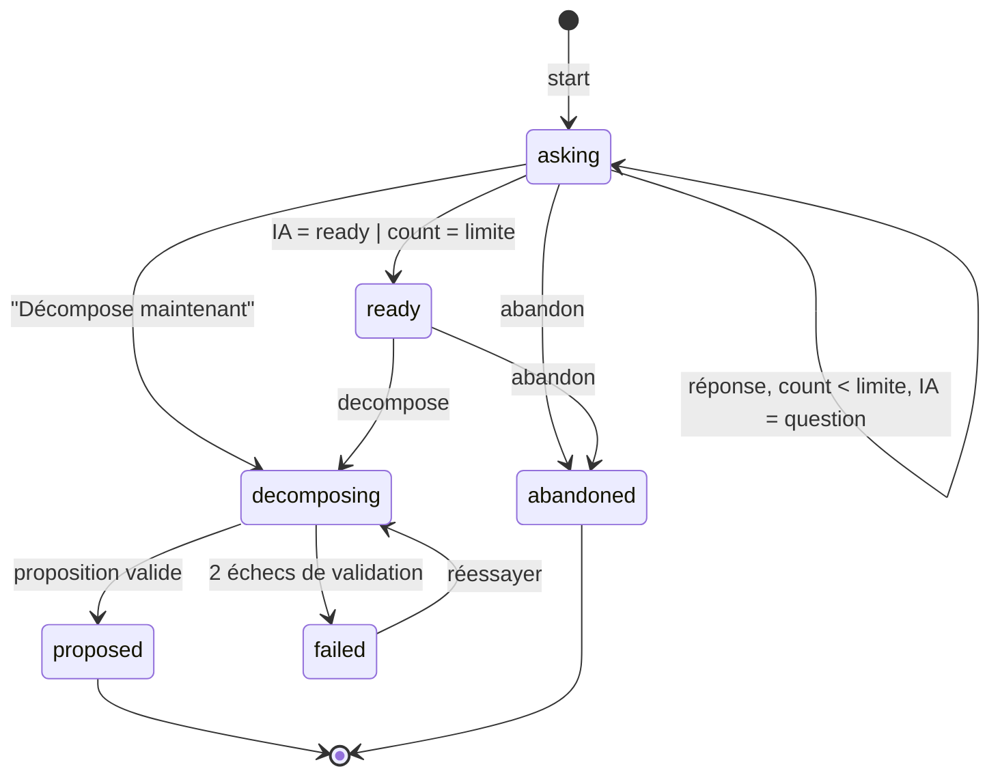

# Data Model — 002 Structuration IA (modèle central)

> Tables partagées par F1, F3, F4, F5. Base SQLite chiffrée (Drizzle), migrations avec `down`.
> Les tables `nodes`, `dependencies`, `idea_links`, `change_log` sont **créées ici** mais **alimentées par F3**
> (acceptation d'une proposition) — cette feature n'y écrit pas (FR-010).

## `categories`
| Champ | Type | Règles |
|-------|------|--------|
| id | text | PK |
| slug | text | unique ; seed : `general`, `achat`, `projet`, `sortie`, `photo`, `it` |
| label / color | text | couleur conforme au contraste AA |
| sort_order | integer | |

## `ideas`
| Champ | Type | Règles |
|-------|------|--------|
| id | text (uuid) | PK |
| text | text | 1..2000 caractères |
| category_id | text? | FK `categories` |
| category_source | text? | `ai` \| `user` |
| status | text | `draft` \| `raw` \| `questioning` \| `pending_review` \| `structured` \| `done` \| `archived` |
| version | integer | +1 à chaque modification de l'idée ou de son arbre |
| created_at / updated_at / archived_at? | text (ISO) | |
Index : `status`, `category_id`, `created_at` ; table FTS5 `ideas_fts(text)` synchronisée par triggers.

## `structuring_sessions`
| Champ | Type | Règles |
|-------|------|--------|
| id | text | PK |
| idea_id | text | FK ; **index unique partiel** `WHERE closed_at IS NULL` (1 session ouverte / idée) |
| kind | text | `decompose` \| `restructure` |
| state | text | voir transitions |
| question_count / question_limit | integer | limite défaut 8 |
| base_version | integer | version de l'idée au démarrage |
| engine | text | `claude` \| `ollama` (dégradé) |
| change_text | text? | description du changement (restructuration) |
| in_flight_since | text? | appel IA en cours (reprise R7) |
| started_at / closed_at? | text | |

## `session_turns`
| Champ | Type | Règles |
|-------|------|--------|
| id | text | PK |
| session_id | text | FK |
| seq | integer | unique par session |
| question_json | text | `QuestionOut` validé |
| answer_json | text? | `{ choice? , text? (≤1000), unknown? }` ; écrit une seule fois (idempotence) |
| created_at / answered_at? | text | |

## `proposals`
| Champ | Type | Règles |
|-------|------|--------|
| id | text | PK |
| source | text | `decomposition` \| `restructure` \| `suggestion` (F7) |
| idea_id | text? | FK |
| session_id | text? | FK ; unique (1 proposition par session) |
| payload_json | text | `DecompositionOut` validé + contrôles R4/R5 |
| base_version | integer | |
| degraded | integer (bool) | |
| status | text | `pending` \| `accepted` \| `rejected` \| `superseded` \| `stale` |
| reason? | text | raison de refus (F3) |
| created_at / decided_at? | text | |
Index : `status`, `idea_id`.

## Tables créées ici, alimentées par F3
| Table | Champs clés | Contraintes |
|-------|-------------|-------------|
| `nodes` | id, idea_id, parent_id?, type (`task`/`condition`/`opportunity`), title (≤120), question?, branch_label?, amount_cents? (≥0), due_date?, status (`blocked`/`ready`/`in_progress`/`done`/`abandoned`), active_branch, to_schedule, investigation, position_x?, position_y? | profondeur ≤ 5 (applicatif) |
| `dependencies` | id, from_node_id, to_node_id, kind (`after_done`/`on_trigger`), trigger_label?, trigger_reached_at? | (from,to) unique ; from ≠ to ; sans boucle (applicatif) |
| `idea_links` | id, idea_id, target_idea_id, kind (`finances`/`related`/`blocks`), origin (`ai`/`user`) | (idea,target,kind) unique ; idea ≠ target |
| `change_log` | id, proposal_id?, actor, entity, entity_id, before_json, after_json, created_at | append-only |

## Transitions — session de structuration

Statut de l'idée : `raw` → `questioning` (start) → `pending_review` (proposed) → `structured` (acceptée, F3).
**Abandon / échec définitif → retour au statut d'avant la session** : `raw` pour une décomposition,
`structured` pour une restructuration (champ `previous_idea_status` mémorisé sur la session) *(analyse I1)*.

Champ ajouté à `structuring_sessions` : `previous_idea_status` (text, requis).

## `settings` (réglages génériques clé/valeur)
| Clé | Défaut | Validation |
|-----|--------|-----------|
| `structuring.question_limit` | 8 | entier 3..15 ; lu au `start`, copié dans `question_limit` de la session *(analyse C2)* |
