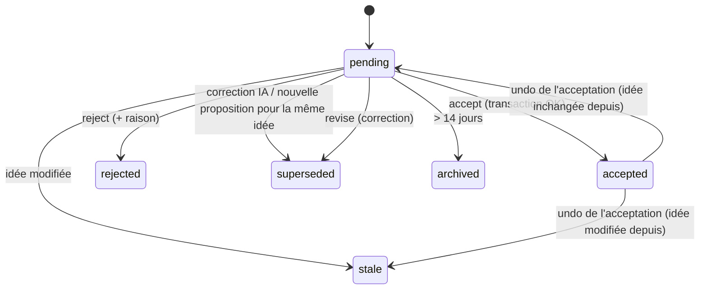

# Data Model — 003 Interface MVP-1 (compléments au modèle central de 002)

## Modifications de tables existantes (002)
| Table | Changement | Raison |
|-------|-----------|--------|
| `proposals` | `status` += `archived` ; + `selection_json?` (éléments cochés + éditions au moment de l'acceptation) ; + `batch_id?` | FR-014, FR-019, R6 |
| `change_log` | + `batch_id` (text, index) ; + `kind` (`accept` \| `manual_edit` \| `undo`) ; + `undone_by_batch?` | R7 annulation par lot |
| `nodes` | `status` inchangé ; `active_branch` (bool) sur les enfants directs d'une condition ; `position_x/y` utilisés | FR-021, FR-023 |
| `dependencies` | `trigger_reached_at` utilisé (null = non atteint) | FR-024 |
| `ideas` | `category_source` : jamais écrasé par l'IA si `user` | FR-010 |

## Nouvelles clés dans `settings` (table clé/valeur de 002)
| Clé | Défaut | Validation |
|-----|--------|-----------|
| `app.shortcut` | `Control+Alt+Space` | accélérateur Electron valide, testé à l'enregistrement |
| `app.launchAtLogin` | `true` | booléen |
| `app.theme` | `system` | `light` \| `dark` \| `system` |
| `app.onboardingDone` | `false` | booléen |
| `capture.draft` | `""` | ≤ 2000 caractères |
| `structuring.question_limit` | 8 (002) | 3..15 |

## Types de vue (non persistés)
```ts
interface TreeView {                 // idée dépliée dans l'organigramme
  idea: IdeaView;
  nodes: Array<NodeView & { depth: number; inactive: boolean }>;
  dependencies: DependencyView[];
  links: IdeaLinkView[];
}
interface ProposalReviewView {       // écran de revue
  proposal: ProposalView;
  items: Array<{ ref: string; change: "add" | "update" | "remove"; node: ProposedNode; dependsOn: string[] }>;
  stale: boolean; degraded: boolean;
}
interface HistoryEntryView { batchId: string; kind: "accept" | "manual_edit" | "undo"; ideaId: string; summary: string; at: string; undoable: boolean }
```

## Transitions — proposition

**Annulation d'une acceptation** *(analyse I2)* : le lot restaure l'arbre, le statut et la version de l'idée ;
la proposition repasse `pending` (ou `stale`) et l'exemple positif associé est retiré.

## Statuts de nœud (R8)
`ready` ⇄ `blocked` calculés ; `in_progress`, `done`, `abandoned` fixés par l'utilisateur ; une tâche d'une
branche inactive est affichée grisée et exclue des « prêtes ».
