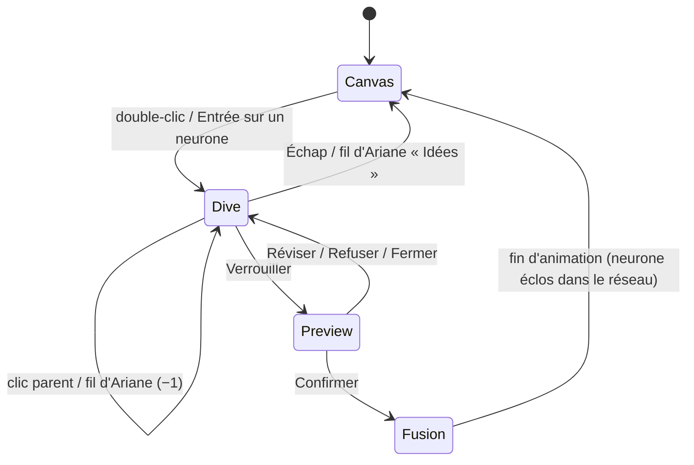

# Data Model — 003 Interface MVP-1 (v2)

> Le modèle central est défini par la spec 002 (`neurons`, `extensions`, `context_assessments`, `syntheses`,
> `plan_*`, `reflection_summaries`, `neuron_links`, `change_log`, `settings`). Cette feature n'ajoute que des
> clés de réglages et des vues.

## Clés `settings` ajoutées
| Clé | Défaut | Validation |
|-----|--------|-----------|
| `app.shortcut` | `Control+Alt+Space` | accélérateur valide, testé à l'enregistrement |
| `app.launchAtLogin` | `true` | booléen |
| `app.theme` | `system` | `light` \| `dark` \| `system` |
| `app.motion` | `auto` | `auto` (suit le système) \| `reduced` |
| `app.onboardingDone` | `false` | booléen |
| `capture.draft` | `""` | ≤ 2000 |

## Vues d'interface (non persistées)
```ts
interface IdeasCanvasView {
  counts: { raw: number; developing: number; hatched: number };
  incubator: RootView[];                  // raw + developing (avec premiers sous-neurones pour developing)
  network: RootView[];                    // hatched
  links: LinkView[];                      // accepted + suggested
}
interface DiveView {                      // plongée
  breadcrumb: Array<{ neuronId: string; title: string }>;
  focus: NeuronView;                      // neurone centré
  parent?: NeuronView;                    // estompé
  children: NeuronView[];
  extensions: ExtensionView[];            // emplacements « + »
  gauge: { level: "insufficient" | "sufficient" | "complete"; missing: string[]; answered: number };
  synthesis?: SynthesisView;              // aperçu en attente
  result?: ActionPlanView | ReflectionSummaryView;   // si éclos
}
interface HistoryEntryView { batchId: string; kind: "confirm_synthesis" | "manual_edit" | "link" | "undo"; rootId: string; summary: string; at: string; undoable: boolean }
```

## Transitions d'interface (plongée)

