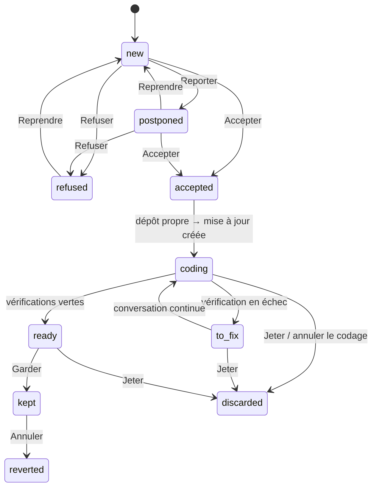

# Data Model — Analyste interne (spec 019)

Migration `0030_analyste` + `migrations/down/0030_analyste.down.sql` (écrit à la main : `DROP` des 4 tables, retrait
des 2 colonnes d'`ai_calls` par reconstruction de table, comme les down précédents).

## observations
| Colonne | Type | Règle |
|---|---|---|
| id | integer PK auto | — |
| at | integer (ms) | non nul |
| family | text | `navigation` · `action` · `erreur` · `performance` |
| event | text | nom du catalogue (`src/shared/analyste/events.ts`), ≤ 48 |
| screen | text? | énumération du catalogue |
| subject_kind | text? | énumération (neuron, element, link, document, widget, conversation, proposal…) |
| subject_ref | text? | pseudonyme 12 hex |
| via | text? | souris · clavier · menu · mcp |
| channel | text? | canal IPC (famille performance) |
| code | text? | type ou code d'erreur, ≤ 48 |
| module | text? | ≤ 48 |
| frames | text? | JSON, ≤ 5 « chemin-relatif:ligne » dans le dépôt |
| duration_ms | integer? | ≥ 0 |
| status | text? | ok · error · cancelled |
| count | integer | défaut 1 (rafales regroupées) |
Index : `(at)`, `(family, at)`, `(event, at)`. La famille **IA** est lue dans `ai_calls` (pas de doublon).

## ai_calls (existante) — ajouts
| Colonne | Type | Règle |
|---|---|---|
| input_fp | text? | 16 hex, seulement si sonde active |
| output_fp | text? | 16 hex, sortie validée seulement |
Index : `(kind, input_fp)`.

## neurons (existante) — ajout
| Colonne | Type | Règle |
|---|---|---|
| hidden | integer | défaut 0 ; 1 = neurone de mise à jour (research R5), ignoré par la carte, les listes et les outils MCP de lecture |

## analyses
| Colonne | Type | Règle |
|---|---|---|
| id | text PK | uuid |
| trigger | text | manual · auto |
| status | text | running · done · failed · cancelled |
| window_from, window_to | integer | période couverte (ms) |
| events | integer | observations dans la période |
| proposals | integer | gardées après contrôle |
| ai_call_id | text? | lien `ai_calls` |
| error_code | text? | — |
| started_at, finished_at | integer | — |
Une seule `running` (contrôle applicatif + index partiel `WHERE status = 'running'` unique).

## proposals
| Colonne | Type | Règle |
|---|---|---|
| id | text PK | uuid |
| analysis_id | text FK → analyses | — |
| category | text | bug · ia_vers_code · parcours · code_mort · evolutivite |
| title | text | 5–80 |
| finding, proposal, gain | text | ≤ 1200 / 1500 / 300 |
| risk | text | faible · moyen · eleve |
| severity | integer | 1–4 |
| confidence | real | 0–1 |
| evidence | text JSON | `{ observations: { key, sentence }[], code: { path, start?, end? }[] }` |
| files | text JSON | chemins relatifs vérifiés |
| without_evidence | integer (bool) | évolutivité sans preuve |
| dedupe_key | text | hash(catégorie + fichiers triés) |
| status | text | voir transitions |
| refusal_reason | text? | ≤ 200 |
| created_at, updated_at | integer | — |
Index : `(status, created_at)`, `(dedupe_key)`.

### Transitions (proposition)

Toute autre transition → `INVALID_TRANSITION`. `accepted` sans mise à jour = acceptation en attente (dépôt sale).

## analyst_updates
| Colonne | Type | Règle |
|---|---|---|
| id | text PK | uuid (`id8` = 8 premiers caractères) |
| proposal_id | text FK unique → proposals | — |
| branch | text unique | `analyste/<id8>-<slug ≤ 30 [a-z0-9-]>` |
| worktree_path | text | `<repo>/.analyste/worktrees/<id8>` |
| base_sha, head_sha, merge_sha, revert_sha | text? | 40 hex |
| status | text | coding · to_fix · ready · keeping · kept · discarded · reverted · failed |
| checks | text JSON | `{ typecheck, lint, prettier, test }` ∈ pending · ok · fail, + `tail` (≤ 50 lignes) par échec |
| deps_changed | integer (bool) | `package.json` / lock touchés |
| conversation_neuron_id | text? | neurone de mise à jour (research R5) |
| discard_reason | text? | ≤ 200 |
| created_at, updated_at | integer | — |
Une seule `coding` ou `to_fix` à la fois. `keeping` = fusion en cours (réconciliée au démarrage, research R8).

## Réglages (table clé/valeur existante, valeurs Zod)
| Clé | Défaut | Bornes |
|---|---|---|
| `analyste.repoPath` | — | dossier vérifié (RepoGuard) |
| `analyste.retentionDays` | 30 | 7–90 |
| `analyste.maxEvents` | 50 000 | 10 000–200 000 |
| `analyste.maxProposals` | 5 | 1–10 |
| `analyste.repeatThreshold` | 5 | 2–50 |
| `analyste.rhythm` | off | off · 1h · 1d · 1w |
| `analyste.minEvents` | 200 | 10–10 000 |
| `analyste.nextRunAt` | — | ms |
Clé HMAC : `SecretStore` (`analyste.hmac`), jamais en base.
