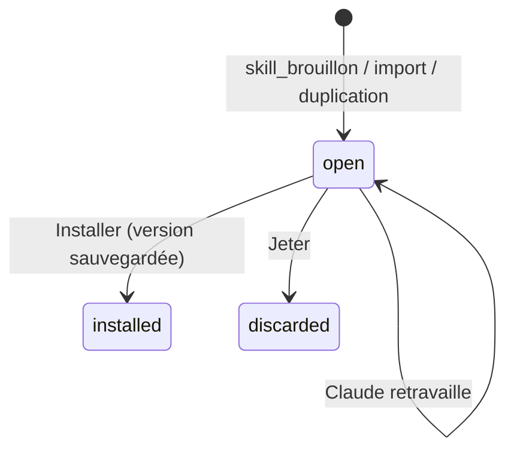

# Data Model — Arbre de skills (spec 020)

Migration `0033_skills` + `migrations/down/0033_skills.down.sql` (écrit à la main : `DROP` des 7 tables). Les skills
eux-mêmes ne sont **pas** stockés : ils sont inventoriés sur le disque à chaque ouverture (cache mémoire).

## Identifiant d'un skill (calculé par le main)
`perso:<nom>` · `projet:<genesisId>:<nom>` · `plugin:<marketplace>/<plugin>:<nom>` — `nom` = nom du dossier
`[a-z0-9][a-z0-9-]{0,63}` ; un dossier au nom non conforme donne un skill « abîmé » non modifiable.

## skill_domains
| Colonne | Type | Règle |
|---|---|---|
| id | text PK | `[a-z0-9_]{2,32}` |
| label | text | ≤ 40 |
| position | integer | ordre des branches |
| pending | integer (bool) | domaine proposé par Claude, non encore validé |
Semés : `projet` Projet & organisation · `design` Design & UI · `docs` Docs & cours · `code` Code & qualité ·
`donnees` Données & IA · `media` Photo & médias · `divers` Divers.

## skill_cards
| Colonne | Type | Règle |
|---|---|---|
| skill_id | text PK | identifiant ci-dessus |
| content_hash | text | empreinte du `SKILL.md` analysé |
| card | text JSON | fiche validée (résumé, quand, éviter, déclencheurs, entrées / sorties, exemples) |
| grid | text JSON | `{ declencheurs, profondeur, garde_fous, exemples }` 0–5 + justifications |
| stars_claude | integer | 1–5 |
| stars_user | integer? | 1–5, prime |
| domain_id | text FK? → skill_domains | — |
| domain_source | text | claude · user (user jamais écrasé) |
| analyzed_at | integer | ms |
| model | text | modèle utilisé |

## skill_links
| Colonne | Type | Règle |
|---|---|---|
| id | text PK | uuid |
| from_id, to_id | text | identifiants de skills, différents |
| kind | text | enchaine_vers · complete · alternative_a · appelle (ajout manuel) |
| origin | text | claude · user |
| reason | text? | ≤ 200 |
| removed | integer (bool) | lien de Claude retiré par mentalyas : jamais reproposé |
Index unique `(from_id, to_id, kind)`. Les liens « appelle » détectés ne sont pas stockés (recalculés).

## skill_drafts
| Colonne | Type | Règle |
|---|---|---|
| id | text PK | uuid |
| family | text | perso · projet |
| project_genesis_id | text? | requis si projet |
| name | text | nom de dossier |
| description | text | ≤ 600 |
| content | text | corps du `SKILL.md` ≤ 100 000 |
| annexes | text JSON | `{ path, content }[]` ≤ 20, chemins relatifs, extensions non exécutables (sauf import autorisé, `allowed_scripts`) |
| allowed_scripts | text JSON | chemins de scripts d'import autorisés un par un ; **vidé** dès que Claude réécrit le brouillon (`skill_brouillon`), dont l'origine passe alors à `claude` (analyse H2) |
| base_hash | text? | empreinte du contenu installé vu à la création (conflit disque) |
| origin | text | claude · import · duplicate |
| import_id | text? | FK → skill_imports |
| source | text JSON? | `{ repo, commit, path }` pour un import |
| status | text | open · installed · discarded |
| created_at, updated_at | integer | ms |
Un seul brouillon `open` par `(family, project_genesis_id, name)`.

## skill_versions
| Colonne | Type | Règle |
|---|---|---|
| id | text PK | uuid |
| skill_id | text | — |
| folder | text | dossier de sauvegarde relatif au profil |
| content_hash | text | — |
| batch_id | text | lot d'historique de l'installation |
| created_at | integer | ms |
10 au plus par skill (la plus ancienne et son dossier supprimés).

## skill_imports
| Colonne | Type | Règle |
|---|---|---|
| id | text PK | uuid |
| repo | text | adresse sans identifiant |
| commit | text? | 40 hex |
| status | text | clone · reperage · audit · ready · done · cancelled · failed |
| error_code | text? | — |
| created_at, finished_at | integer | ms |

## skill_import_candidates
| Colonne | Type | Règle |
|---|---|---|
| id | text PK | uuid |
| import_id | text FK | — |
| name | text | nom de dossier (normalisé) |
| rel_dir | text | dossier relatif dans le dépôt |
| files | text JSON | `{ path, size, executable }[]` |
| verdict | text | sur · a_revoir · dangereux |
| reasons | text JSON | `{ text, line? }[]` ≤ 8 |
| kept | integer (bool) | — |

## Historique
Type de lot `skills` (annulable) ; entités : `skill_card_user` (étoiles, domaine), `skill_link`, `skill_files` (avant /
après de chaque fichier écrit par Installer / Revenir), `skill_draft` (création / modification par Claude, marqué « par
Claude »).

## États

