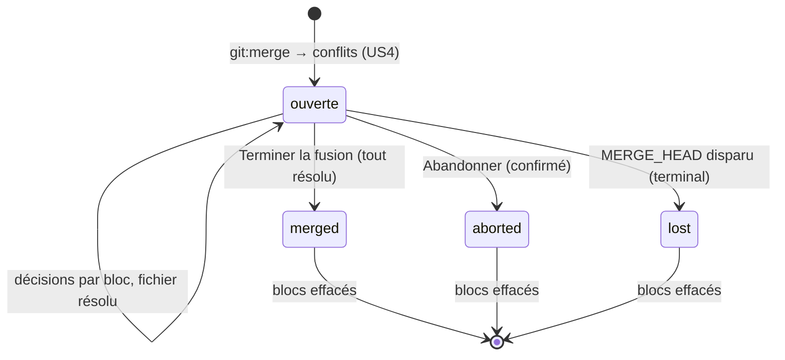
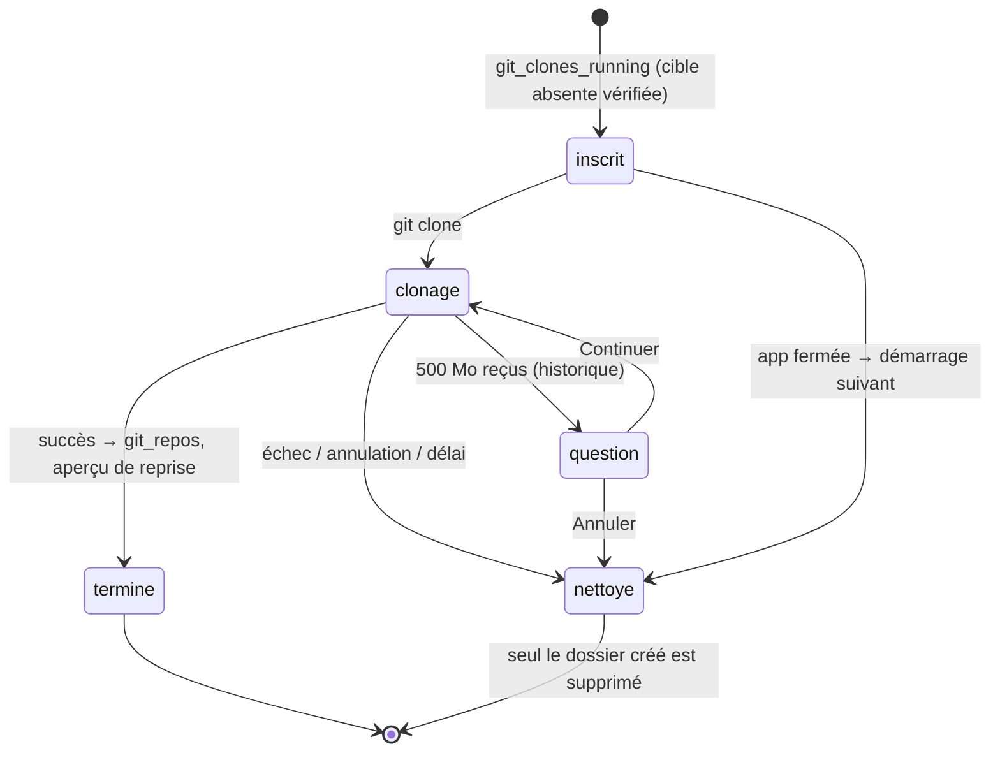

# Data Model — Git et GitHub (spec 021)

Une migration `00NN_git` (**prochain numéro libre au moment de coder** : 0033 est réservée par la spec 020) +
`src/main/infrastructure/db/migrations/down/00NN_git.down.sql` écrit à la main (`DROP TABLE` des 7 tables, dans l'ordre
inverse des dépendances). Les dépôts eux-mêmes ne sont **pas** stockés : état, branches, diff et historique sont relus
dans git à la demande (cache mémoire de session pour l'historique).
Règle commune (FR-028, FR-039, SC-004) : **aucune** colonne ne contient un message de commit, un diff, un chemin
absolu, une adresse avec identifiant, un jeton, un nom ou un e-mail d'auteur.

## git_repos — dépôt suivi (une ligne par genesis lié à un dossier git)
| Colonne | Type | Règle |
|---|---|---|
| genesis_id | text PK → neurons.id | genesis du projet (`kind = 'genesis'`) |
| default_remote | text? | nom du remote suivi (`origin`) |
| remote_url | text? | adresse **sans identifiant** (`gitUrl.display`) |
| github_repo | text? | `^[A-Za-z0-9-]{1,39}/[A-Za-z0-9._-]{1,100}$` si l'hôte est `github.com` |
| upstream_repo | text? | dépôt d'origine après un fork (US6), même format |
| last_fetch_at | text? | ISO (Europe/Brussels) de la dernière vérification de GitHub |
| last_seen_commit | text? | 40 hex ; « Depuis ta dernière visite » (US3) |
| sensitive_checked_head | text? | 40 hex ; dernier commit dont l'historique a été contrôlé (US2) |
| cloned | integer (bool) | créé par un clone de l'app (jamais de confiance d'office) |
| created_at, updated_at | text | ISO |
La confiance n'est **pas** dupliquée : elle est lue dans `trusted_projects` (`projectKey(realpath)`, spec 014).

## git_operations — journal des écritures (FR-039)
| Colonne | Type | Règle |
|---|---|---|
| id | text PK | uuid |
| genesis_id | text? → neurons.id | `null` pour un clone avant création du genesis |
| kind | text | commit · revert · branch_create · branch_switch · fetch · pull · merge · merge_finish · merge_abort · push · repo_create · clone · fetch_all · fork · pr_create · pr_comment · issue_create · extract |
| status | text | ok · failed · cancelled |
| error_code | text? | code applicatif (`HOOK_FAILED`, `NON_FAST_FORWARD`…) |
| commit_hash | text? | 7 hex |
| branch | text? | nom de branche (vérifié) |
| remote | text? | nom du remote, jamais l'adresse |
| host | text? | hôte seul (clone) |
| number | integer? | numéro de PR / issue créée |
| count | integer? | commits poussés, fichiers commités… |
| started_at, finished_at | text | ISO |
Index `(genesis_id, started_at)`. Alimente l'Historique de l'app (« Commit `a1b2c3d` sur `main` »). Les sorties de git
et de `gh` ne sont jamais écrites (codes seulement).

## git_clones_running — clones en cours (US3, FR-019)
| Colonne | Type | Règle |
|---|---|---|
| id | text PK | `cloneId` |
| target_dir | text | dossier **créé par l'app** (absent avant, vérifié) |
| profile | text | historique · superficiel |
| started_at | text | ISO |
Ligne écrite avant le lancement, effacée à la fin ; au démarrage, chaque cible restante est supprimée puis la ligne
effacée. Seule table qui garde un chemin absolu, le temps du clone (nécessaire au nettoyage).

## git_merge_sessions — fusion en cours (US4)
| Colonne | Type | Règle |
|---|---|---|
| id | text PK | uuid |
| genesis_id | text → neurons.id | une session ouverte (`finished_at` null) par genesis |
| merge_head | text | 40 hex, commit fusionné |
| head | text | 40 hex, commit de départ |
| started_at | text | ISO |
| finished_at | text? | ISO |
| outcome | text? | merged · aborted · lost |

## git_conflict_hunks — décisions par bloc (US4, effacées en fin de session)
| Colonne | Type | Règle |
|---|---|---|
| id | text PK | uuid |
| session_id | text FK → git_merge_sessions.id | — |
| path | text | chemin relatif (`RelPath`) |
| hunk_index | integer | ≥ 0 |
| proposal | text? | texte proposé par Claude (≤ 100 000) |
| explanation | text? | ≤ 600 |
| confidence | text? | sure · check |
| decision | text? | ours · theirs · both · claude · manual |
| manual_text | text? | ≤ 200 000 |
| updated_at | text | ISO |
`UNIQUE(session_id, path, hunk_index)`. Contient temporairement du code d'un collègue : **effacé** à `merged`,
`aborted` ou `lost` (la session reste, sans contenu).

## git_author_aliases — identités fusionnées (US5, FR-028)
| Colonne | Type | Règle |
|---|---|---|
| id | text PK | uuid |
| genesis_id | text → neurons.id | par projet |
| alias_key | text | clé d'auteur (HMAC de l'e-mail normalisé, research R13) |
| main_key | text | clé de l'identité principale |
| created_at | text | ISO |
`UNIQUE(genesis_id, alias_key)` ; `alias_key ≠ main_key` ; pas de chaîne (une principale n'est jamais alias).
Historisé et annulable (type de lot `git`).

## git_issue_links — liens issue / PR ↔ nœud (US6, FR-033)
| Colonne | Type | Règle |
|---|---|---|
| id | text PK | uuid |
| genesis_id | text → neurons.id | — |
| kind | text | issue · pr |
| number | integer | ≥ 1 |
| neuron_id | text → neurons.id | nœud de la carte du projet |
| created_at | text | ISO |
| deleted_at | text? | suppression douce (annulable) |
`UNIQUE(neuron_id, kind, number)` parmi les lignes actives ; index `(genesis_id)`. Aucun titre stocké (lu à
l'ouverture, cache mémoire 5 min) ; rien n'est écrit sur GitHub.

## Réglages (table existante des réglages de l'app)
`git.lastCloneParent` : dernier dossier parent de clone (FR-019), chemin réel ; jamais le dossier de données.

## Historique de l'app
Type de lot `git` (annulable) ; entités `git_issue_link` et `git_author_alias` (avant / après). Les opérations git
(commit, push…) ne sont pas « annulables » par l'Historique de l'app : elles apparaissent en lecture seule depuis
`git_operations` ; leur retour arrière est un `revert` sur clic (FR-007).

## Vues en mémoire (non stockées)
- **Clé d'auteur** : `HMAC(secret git-author-hmac, email.trim().toLowerCase())`, 16 hex ; nom, e-mail et initiales
  seulement en mémoire et vers le renderer ; pseudonymes « Auteur A, B… » pour Claude, recalculés par requête.
- **Clone en cours** : `{ cloneId, profile, display, phase, percent, receivedBytes, largeAsked }`.
- **Prévisualisation de push / publication** : calculée à la demande, jamais stockée.

## États

